# MASTER PRODUCT REQUIREMENTS DOCUMENT (PRD)

**Project Title:** SANJEEVANI-CONNECT (संजीवनी-कनेक्ट)  
**Problem Statement Code:** SIH26133  
**Problem Title:** Accessibility and Quality of Public Healthcare Services, Particularly in Rural and Underserved Areas  
**Document Reference:** PRD-SIH26133-V1.0-FINAL  
**Target Platform:** Web (PWA / Responsive) & Mobile-First Android Client  
**Classification:** Single Source of Truth (SSOT) — Engineering, Product, Architecture & Clinical Blueprint  
**Date:** September 2026  
**Status:** Approved & Frozen for Hackathon Implementation  

---

## 1. Executive Summary

Rural and underserved populations across India face compounding barriers to timely, quality public healthcare: geographic remoteness, severe specialist shortages at Primary Health Centres (PHCs) and Community Health Centres (CHCs), fragmented diagnostic capabilities, broken paper-based referral chains, stock-out unpredictability, and intermittent digital connectivity. While the Government of India has laid visionary infrastructure through Ayushman Bharat Digital Mission (ABDM), Ayushman Arogya Mandirs (AAMs), and eSanjeevani, the ground-level operational link—coordinating discovery, assisted multilingual triage, closed-loop referrals, resource visibility, and continuity of care—remains disconnected.

**SANJEEVANI-CONNECT** is an **Integrated Public Healthcare Access, Care Continuity, Referral, and Resource Intelligence Platform**. It is purposefully engineered to strengthen, digitize, and interconnect the existing public healthcare hierarchy:
$$\text{Sub-Centre / AAM (Frontline)} \longleftrightarrow \text{PHC (Primary)} \longleftrightarrow \text{CHC / Sub-District Hospital} \longleftrightarrow \text{District Hospital (Tertiary)}$$

### Key Product Pillars
1. **Intelligent Multilingual Triage & Guided Intake:** Vernacular speech-to-text (Bhashini/Whisper-derived) and structured symptom extraction supporting 10+ Indian languages, functioning strictly as an intake assistant with strict human-in-the-loop clinical boundaries.
2. **Clinical-Suitability-First Facility Matching:** A deterministic, multi-factor matching engine evaluating treatment suitability, equipment operational status, specialist shifts, bed/ICU occupancy, and travel time.
3. **Closed-Loop Referral & Transfer Engine:** End-to-end referral state machine with bi-directional facility communication, automated SLA escalation, guaranteed fallback rerouting, and real-time ambulance transport tracking abstraction.
4. **Resilient Offline-First Architecture:** Local encrypted datastores with Conflict-Free Replicated Data Type (CRDT) mechanics and idempotent background synchronization queues for frontline Accredited Social Health Activists (ASHAs) and Auxiliary Nurse Midwives (ANMs) operating in zero-connectivity environments.
5. **Unified Longitudinal Health Timeline:** FHIR R4-compliant longitudinal encounters, vitals, diagnostic reports, and e-prescriptions tied to verified citizen identifiers.
6. **Seasonal Resource & Epidemic Forecasting:** Time-series predictive modeling over historical disease patterns (Dengue, Malaria, acute diarrheal diseases, seasonal respiratory infections) enabling district health officers to preempt medicine stock-outs and bed surges.

---

## 2. Problem Statement

### 2.1 Official Definition (SIH26133)
> **SIH26133:** Accessibility and quality of public healthcare services, particularly in rural and underserved areas.

### 2.2 Operational Context in the Indian Public Health System
In India's three-tier rural public healthcare infrastructure:
* **Sub-Centres / Ayushman Arogya Mandirs (serving 3,000–5,000 population):** Staffed by ANMs and Community Health Officers (CHOs). Primary care is restricted to basic maternal/child screening and essential medicines. Vitals and health registers are overwhelmingly physical paper registers (e.g., RCH registers).
* **Primary Health Centres (PHCs, serving 20,000–30,000 population):** Staffed by 1–2 Medical Officers (MBBS). Constrained diagnostic testing (basic blood/urine strips only), frequent power outages, and intermittent telecom connectivity.
* **Community Health Centres (CHCs, serving 80,000–120,000 population):** 30-bed secondary facilities meant to have 4 specialists (Surgeon, Physician, Gynecologist, Pediatrician), but over 70% of sanctioned specialist posts remain vacant in rural districts.
* **District Hospitals (DHs, serving 1–2 million population):** Fully equipped tertiary institutions located 40–120 km away from peripheral villages, perpetually overcrowded with OPD wait times exceeding 4–7 hours because patients bypass primary facilities.

---

## 3. Problem Analysis

### 3.1 Root Causes of Failure in Existing Solutions

| Dimension | Ground Reality / Pain Point | System Failure Mode | SANJEEVANI-CONNECT Solution |
| :--- | :--- | :--- | :--- |
| **Discovery** | Patients travel 50+ km to DH based on hearsay, only to find the specialist on leave or the X-ray machine defective. | Resource blindness; massive out-of-pocket travel expenditure; lost daily wages. | Real-time service capability & operational equipment verification before departure. |
| **Referrals** | Handwritten referral slips ("Refer to DH for further management") handed to patients with zero digital records sent ahead. | 45–60% referral drop-out; repeated diagnostic tests; zero receipt accountability at the receiving hospital. | Closed-loop digital referral handshake, slot reservation, and pre-arrival clinical summary transmission. |
| **Diagnostics** | Phlebotomy samples collected in PHCs are batched manually; paper reports arrive weeks later or get lost. | Delayed critical interventions; redundant re-testing at higher facilities. | Digital diagnostic order tracking with integrated offline-sync for rural phlebotomy camps. |
| **Continuity** | Patients carry fragile paper files, plastic bags of prescriptions, and faded thermal ECG strips. | Fragmented history; contraindications missed during emergency consultations. | Longitudinal Citizen Health Timeline linked via secure identifiers with role-based clinical views. |
| **Connectivity** | Rural PHCs and tribal hamlets experience 2G speeds or total network blackouts for days during monsoon. | Web-only cloud platforms become completely inaccessible and unusable. | Offline-first encrypted SQLite/IndexedDB queue with automatic background sync upon re-connection. |
| **Language & Literacy** | Complex English/medical terminology forms intimidate rural citizens and slow down frontline workers. | Digital divide; high data-entry friction for ASHAs and CHOs. | Multilingual vernacular speech assistant (Bhashini-integrated) with voice-guided intake. |

---

## 4. Target Users

### 4.1 Primary End-Users
1. **Rural Citizens / Patients:** Low-to-moderate literacy, regional language speakers, entry-level Android smartphones (or relying on community health kiosks/ASHAs).
2. **Frontline Health Workers (ASHA / ANM / CHO):** Field workers conducting home visits, maternal-child tracking, screening non-communicable diseases (NCDs), and coordinating primary care.
3. **Medical Officers & Specialists (PHC / CHC / DH Doctors):** Overburdened clinicians conducting 100+ OPD consultations per day; require ultra-fast, 30-second summary views and 3-click referral workflows.
4. **Facility Staff (Pharmacists, Lab Technicians, Receptionists):** Operators managing local token queues, issuing drug batches, entering lab test values, and updating bed tallies.
5. **District Health Officials (CMHO / District Surveillance Officers):** Administrative decision-makers monitoring resource utilization, referral compliance, disease outbreaks, and supply chains.

---

## 5. Stakeholders

* **Ministry of Health and Family Welfare (MoHFW), Govt of India**
* **National Health Authority (NHA) — ABDM Integration Ecosystem**
* **State Health Missions (NHM) & District Collectorates**
* **Primary, Secondary, and Tertiary Public Healthcare Institutions**
* **Community Panchayati Raj Institutions (PRIs)**
* **Frontline Worker Associations (ASHA / ANM Unions)**

---

## 6. Product Vision

> **"To ensure that no Indian citizen in a rural or underserved area is denied timely, dignified, and continuous healthcare due to geographic remoteness, information asymmetry, or systemic resource fragmentation."**

SANJEEVANI-CONNECT transforms rural healthcare delivery from a fragmented, reactive, paper-bound struggle into a proactive, intelligent, closed-loop continuum of care.

```
+----------------------------------------------------------------------------------------------------+
|                                    CONTINUUM OF CARE PLATFORM                                      |
|                                                                                                    |
|  [ Discovery ] ---> [ Triage ] ---> [ Teleconsult / OPD ] ---> [ Diagnostic ] ---> [ Referral ]   |
|         ^                                                                               |          |
|         |                                                                               v          |
|  [ Outcome Close ] <--- [ ASHA Follow-up ] <--- [ Medicine Dispense ] <--- [ Transfer / Inpatient ]|
+----------------------------------------------------------------------------------------------------+
```

---

## 7. Goals

### 7.1 Quantitative Goals (Target Benchmarks for Production Pilot)
* **G-01:** Reduce unnecessary patient travel to higher-tier facilities by **40%** through verified local service discovery and teleconsultation.
* **G-02:** Increase verified referral completion rate from the current estimated 35% to **>80%** within 6 months of deployment.
* **G-03:** Decrease average physical OPD queue waiting time at District Hospitals by **50%** via scheduled referral tokens and digital queue dispatching.
* **G-04:** Achieve **100% offline data integrity** for frontline ASHA field visits with zero data loss over intermittent connectivity.
* **G-05:** Reduce rural medicine stock-out frequency by **35%** using predictive seasonal demand forecasting.

### 7.2 Qualitative Goals
* **G-06:** Build trust in public health institutions by giving citizens visibility into doctor availability, medicine stocks, and token status.
* **G-07:** Empower ASHAs and ANMs with automated digital follow-up reminders, eliminating burdensome manual paper registers.
* **G-08:** Deliver clinical decision-support transparency while strictly preserving physician autonomy.

---

## 8. Non-Goals

To prevent scope creep and maintain safety during hackathon execution, the following boundaries are formally established:
* **NG-01:** Autonomous AI Diagnosis or Prescribing: The platform will **never** prescribe drugs, generate final diagnoses, or replace doctor examinations.
* **NG-02:** Live Hardware Telemetry / IoT Device Firmware: We integrate with diagnostic result data payloads, not the raw firmware/drivers of laboratory analyzers.
* **NG-03:** Autonomous Emergency Fleet Dispatching: We provide verified ambulance availability, location tracking, and transfer requests; we do not replace national 108/102 emergency telephony command-and-control dispatch software.
* **NG-04:** Commercial / Private Billing & Insurance Claims: The system is dedicated to the public healthcare system (Free / Ayushman Bharat subsidized care); commercial revenue cycle management is out of scope.

---

## 9. Scope

```
+-----------------------------------------------------------------------------+
|                                PROJECT SCOPE                                |
+------------------------------------+----------------------------------------+
| IN SCOPE (Hackathon Core MVP)      | OUT OF SCOPE (Deferred / Roadmap)      |
+------------------------------------+----------------------------------------+
| * Multilingual Voice & Text Intake | * Integration with proprietary private |
| * Facility Service Discovery       |   EMR hospital vendors                 |
| * Deterministic Facility Matcher   | * Direct drone-delivery dispatching    |
| * Digital Token & Queue Lifecycle  | * Raw DICOM 3D image slice rendering   |
| * WebRTC Teleconsultation Module   |   (Web viewer uses PNG/PDF summaries)  |
| * Closed-Loop Referral Engine      | * Autonomous billing reimbursement     |
| * Longitudinal Patient Timeline    | * Automated SMS gateway funding/direct |
| * Encrypted Offline ASHA Sync      |   telecom SS7 interconnects            |
| * Seasonal Epidemic Forecasting    |                                        |
| * Role-Based Dashboards (5 Roles)  |                                        |
+------------------------------------+----------------------------------------+
```

---

## 10. Actors & Permissions

### 10.1 Human Actors
1. **`ACT-PAT` (Patient / Citizen):** Registers self/family, searches facilities, views tokens, undergoes teleconsultation, views own health records, rates facility experience.
2. **`ACT-ASHA` (Frontline Worker / ASHA / ANM):** Registers citizens in field, records vitals, initiates assisted voice triage, schedules appointments, conducts maternal/child follow-ups, syncs offline registers.
3. **`ACT-DOC` (Doctor / Medical Officer / Specialist):** Reviews patient queue, accesses longitudinal medical history, conducts teleconsultations, records clinical notes, issues digital e-prescriptions, orders diagnostics, initiates digital referrals.
4. **`ACT-STAFF` (Facility Staff / Pharmacist / Lab Tech):** Manages local facility tokens, updates bed/equipment operational state, updates medicine inventory, logs diagnostic results, confirms arrival of referred patients.
5. **`ACT-ADMIN` (District / State Health Administrator):** Analyzes district-wide health KPIs, tracks disease outbreak alerts, audits referral compliance, monitors stock levels, manages facility credentials.

### 10.2 External & System Actors
1. **`SYS-AI` (AI/ML Inference Service):** Microservice performing speech transcription (Bhashini/Whisper), entity extraction, clinical summarization, and seasonal disease forecasting.
2. **`SYS-RTC` (Teleconsultation Signaling & Media Server):** WebRTC/SFU infrastructure managing secure audio-video peer connections.
3. **`SYS-SYNC` (Offline Synchronization Daemon):** Background engine managing delta-change vectors, CRDT merges, and cryptographic validation between local client stores and central backend.
4. **`SYS-NOTIF` (Notification Broker):** Service dispatching in-app alerts, push notifications (FCM), and SMS/WhatsApp webhook payloads.

---

## 11. User Personas

### Persona 1: Sunita Devi (Rural Citizen / Patient)
* **Demographics:** 34 years old, resident of Barwani village (Madhya Pradesh). High school education (Hindi primary).
* **Environment:** Owns a budget 4G smartphone, but connectivity in her village drops frequently.
* **Pain Point:** Experiences persistent fever and abdominal pain. Unsure whether the local PHC (8 km away) has a doctor today or if she must spend Rs. 800 on a private jeep to travel 65 km to the District Hospital.
* **Platform Need:** A voice-activated interface in Hindi where she can speak her symptoms, see if the local PHC doctor is available, or get a scheduled token directly to the CHC.

### Persona 2: Rekha Bai (ASHA Worker)
* **Demographics:** 29 years old, frontline community health worker covering 1,200 villagers.
* **Device:** Government-issued budget Android tablet (Android 11, 3GB RAM).
* **Pain Point:** Carries 4 physical paper registers for ANC (Antenatal Care), immunization, and NCDs. Spends 3 hours every evening transcribing handwritten notes. Half her referred high-risk pregnant mothers drop out because District Hospital queues are overwhelming.
* **Platform Need:** An offline-capable tablet interface allowing quick door-to-door vitals recording, 1-click referral tracking with confirmed booking, and automated alerts for overdue infant immunizations.

### Persona 3: Dr. Vikram Deshmukh (Medical Officer, Primary Health Centre)
* **Demographics:** 31 years old, MBBS, sole doctor at a rural PHC seeing 90 patients per morning.
* **Pain Point:** Constrained by lack of ultrasound and biochemistry analyzers. When referring complex cases to the District Hospital, he has no way of knowing if the patient ever reached, what diagnosis was made, or what treatment was given.
* **Platform Need:** A rapid 3-click interface to generate structured referrals that transmit clinical notes directly to the District specialist, complete with confirmation receipts when the patient arrives.

---

## 12. User Journeys

### 12.1 Primary Assisted Journey: ASHA Field Visit to Closed-Loop Referral


---

## 13. Functional Requirements

### 13.1 Authentication & Profile Management (`FR-AUTH`)
* **FR-AUTH-001:** The system shall support multi-factor authentication via Mobile OTP (SMS/WhatsApp simulation) for Citizens.
* **FR-AUTH-002:** The system shall enforce Role-Based Access Control (RBAC) with cryptographic JWT access tokens (15-min expiry) and sliding refresh tokens (7-day expiry).
* **FR-AUTH-003:** Frontline health workers and clinicians shall be verified against an authorized institutional registry with role assignment (`ASHA`, `ANM`, `DOCTOR`, `FACILITY_STAFF`, `DISTRICT_ADMIN`).
* **FR-AUTH-004:** The system shall support Aadhaar-compatible Mock/Sandbox ABHA (Ayushman Bharat Health Account) 14-digit ID creation and address resolution for demo compliance.

### 13.2 Citizen Healthcare Discovery (`FR-DISC`)
* **FR-DISC-001:** The system shall enable geolocated and administrative-hierarchy (State $\rightarrow$ District $\rightarrow$ Block $\rightarrow$ Village) facility search.
* **FR-DISC-002:** The system shall display verified operational status of critical medical equipment (e.g., Ultrasound, X-Ray, ECG, Dialysis) at each facility with a mandatory "Last Verified" timestamp.
* **FR-DISC-003:** The system shall display real-time doctor and specialist duty rosters for each facility (Active, On-Duty, On-Call, Absent).
* **FR-DISC-004:** The system shall execute treatment-based facility matching based on user-entered symptoms or clinical requirements.

### 13.3 Assisted Voice Triage & Intake (`FR-VOICE`)
* **FR-VOICE-001:** The system shall accept audio speech streams in 10 Indian languages (Hindi, Marathi, Bengali, Telugu, Tamil, Kannada, Gujarati, Odia, Punjabi, English).
* **FR-VOICE-002:** The system shall extract structured clinical entities (Symptoms, Duration, Severity, Pre-existing conditions) from transcripts into a standardized JSON intake payload.
* **FR-VOICE-003:** The system shall execute red-flag deterministic rule checks (e.g., acute chest pain radiating to arm, systolic BP $>180$, severe breathlessness, postpartum hemorrhage) and instantly trigger emergency UI escalations.
* **FR-VOICE-004:** The system shall present all AI-extracted information as an *Intake Draft* requiring mandatory clinician or ASHA confirmation before committing to the patient's record.

### 13.4 Token & Queue Lifecycle Management (`FR-QUEUE`)
* **FR-QUEUE-001:** The system shall generate sequential, tamper-evident daily tokens per facility, department, and doctor.
* **FR-QUEUE-002:** The queue engine shall support priority classification: `EMERGENCY` (Priority 1), `REFERRED_INBOUND` (Priority 2), `SCHEDULED_TELECONSULT` (Priority 3), and `WALK_IN` (Priority 4).
* **FR-QUEUE-003:** The system shall calculate a dynamically updated Estimated Wait Time (EWT) based on trailing average consultation duration over the preceding 10 completed consultations.
* **FR-QUEUE-004:** The system shall provide state transitions: `GENERATED` $\rightarrow$ `CALLED` $\rightarrow$ `IN_CONSULTATION` $\rightarrow$ `COMPLETED` / `NO_SHOW` / `CANCELLED`.

### 13.5 WebRTC Teleconsultation (`FR-TELE`)
* **FR-TELE-001:** The system shall establish low-bandwidth peer-to-peer WebRTC video/audio sessions between patients/ASHAs and authorized clinicians.
* **FR-TELE-002:** The teleconsultation interface shall provide adaptive bitrate streaming, gracefully degrading to pure audio when bandwidth drops below 64 kbps.
* **FR-TELE-003:** The clinician teleconsultation console shall present a split-screen view: Live Video + Longitudinal Patient Record + Real-Time Prescription Pad.
* **FR-TELE-004:** Teleconsultation encounters shall record structured digital clinical notes, ICD-10 codings, diagnostic orders, and digitally signed e-prescriptions.

### 13.6 Closed-Loop Referral & Transfer Engine (`FR-REF`)
* **FR-REF-001:** Clinicians shall be able to initiate digital referrals specifying clinical rationale, urgency tier (`IMMEDIATE_EMERGENCY`, `URGENT_24HR`, `ROUTINE_7DAYS`), required service, and target facility.
* **FR-REF-002:** The system shall automatically transmit the patient's full referral dossier (clinical notes, vitals, lab reports) to the receiving facility's referral inbox.
* **FR-REF-003:** Receiving facilities shall be restricted to three formal response actions: `ACCEPT_WITH_SLOT`, `REJECT_WITH_REASON`, or `REQUEST_ADDITIONAL_INFO`.
* **FR-REF-004:** If a referral remains unacknowledged past its SLA threshold (Emergency: 30 min, Urgent: 4 hours, Routine: 24 hours), the system shall trigger automated escalation and provide 1-click fallback rerouting to the next best facility.
* **FR-REF-005:** The referral lifecycle shall not be marked `CLOSED` until the receiving facility enters a consultation outcome and dispatches a digital receipt to the referring facility.

### 13.7 Longitudinal Patient Records (`FR-EHR`)
* **FR-EHR-001:** The system shall maintain a chronological, tamper-evident longitudinal health timeline for every registered citizen.
* **FR-EHR-002:** Health records shall adhere to FHIR R4 resource definitions (`Patient`, `Encounter`, `Observation`, `Condition`, `MedicationRequest`, `DiagnosticReport`).
* **FR-EHR-003:** Access to patient records shall be governed by granular patient consent tokens, with mandatory emergency override (Break-Glass) logging for accredited trauma doctors.

### 13.8 Offline Field Synchronization (`FR-SYNC`)
* **FR-SYNC-001:** The mobile/PWA client for ASHAs shall cache master data (village lists, drug catalogs, facility registries) locally in encrypted SQLite (SQLCipher) or IndexedDB.
* **FR-SYNC-002:** Frontline workers shall be able to register patients, record vitals, log follow-ups, and queue referrals while completely offline.
* **FR-SYNC-003:** Upon network restoration, the sync engine shall execute bi-directional delta synchronization using Logical Clock Timestamps and deterministic Last-Write-Wins (LWW) / Field-Level CRDT conflict resolution.

### 13.9 Essential Resource Intelligence (`FR-RES`)
* **FR-RES-001:** Facility staff shall update stock status for essential drugs (EDL - Essential Drug List) with quantities, batch numbers, and expiry dates.
* **FR-RES-002:** The system shall flag blood bank inventories by blood group, component type, volume units, and verification timestamp; data older than 12 hours shall display a prominent "Stale Status - Call to Verify" warning.
* **FR-RES-003:** The system shall maintain ambulance availability, operating status (Available, In-Transit, Maintenance), base station, and driver contact abstraction.
* **FR-RES-004:** The AI inference module shall calculate a 30-day forward demand forecast for seasonal epidemic medicines (ORS, Paracetamol, Artesunate, Doxycycline) based on historical incidence and precipitation patterns.

---

## 14. Detailed Feature Specifications

### 14.1 Feature Spec: Multi-Factor Facility Matching Engine (`FEAT-MATCH`)
* **Description:** Algorithms matching a patient's clinical need to the nearest, fully capable, non-overloaded public health facility.
* **Scoring Algorithm:**
$$\text{Score}(F) = w_1 \cdot S_{\text{clinical}}(F) + w_2 \cdot S_{\text{avail}}(F) + w_3 \cdot S_{\text{capacity}}(F) + w_4 \cdot S_{\text{proximity}}(F)$$
Where:
* $S_{\text{clinical}}(F) \in \{0, 1\}$: Binary gate. Must possess the exact required specialty AND operational equipment. If 0, total score is 0.
* $S_{\text{avail}}(F) \in [0, 1]$: Doctor shift active now or within arrival window ($t_{\text{travel}}$).
* $S_{\text{capacity}}(F) = 1 - \left(\frac{\text{Current Active Queue}}{\text{Daily Facility Capacity}}\right)$.
* $S_{\text{proximity}}(F) = \max\left(0, 1 - \frac{\text{Distance in km}}{100}\right)$.
* Weights: $w_1 = 0.40, w_2 = 0.25, w_3 = 0.20, w_4 = 0.15$.
* **Edge Case Handling:** If all nearby facilities are overloaded ($S_{\text{capacity}} < 0.10$), the system alerts the district administrative desk to authorize temporary emergency bed surge buffers.

---

## 15. AI/ML Requirements

### 15.1 Architectural Scope of AI Services
All AI capabilities reside strictly in an isolated microservice (`SYS-AI`). Communication with the core backend occurs via authenticated, versioned REST/gRPC contracts.

```
+--------------------------------------------------------------------------------------------------+
|                                    AI / ML BOUNDARY ARCHITECTURE                                 |
|                                                                                                  |
|  [ Frontend UI ] ---> ( Audio / Text ) ---> [ Core Backend API ]                                 |
|                                                     |                                            |
|                                        ( Auth Token + Versioned Payload )                        |
|                                                     v                                            |
|                                            [ AI / ML Microservice ]                              |
|                                                     |                                            |
|                  +----------------------------------+----------------------------------+         |
|                  |                                  |                                  |         |
|                  v                                  v                                  v         |
|         [ ASR Speech-to-Text ]           [ Clinical NER & Triage ]          [ Seasonal Forecast ]|
|          (Whisper / Bhashini)               (Indic-BERT / Med-NLP)            (Prophet / XGBoost)|
|                  |                                  |                                  |         |
|                  +----------------------------------+----------------------------------+         |
|                                                     |                                            |
|                                        ( Structured JSON + Confidence )                          |
|                                                     v                                            |
|                                            [ Core Backend API ]                                  |
|                                                     |                                            |
|                                           ( Clinician Review Gate )                              |
|                                                     v                                            |
|                                       [ Committed Clinical Record ]                              |
+--------------------------------------------------------------------------------------------------+
```

### 15.2 ML Service Specifications

| Capability | Model Architecture / Foundation | Input Contract | Output Contract | Latency SLA | Fallback Strategy |
| :--- | :--- | :--- | :--- | :--- | :--- |
| **Multilingual ASR** | Bhashini IndicASR / OpenAI Whisper Fine-Tuned | Raw PCM/WAV Audio (16kHz, mono) + Language Hint | Text Transcript + Word Confidence Scores | $< 1200\text{ ms}$ | Audio playback attached to record; manual text entry by ASHA. |
| **Symptom & Entity Extraction** | Indic-BERT NER / Med-Spacy Regex Pipeline | Clean Text Transcript + Patient Age/Gender | JSON Array of Entities (Symptom, Severity, Duration) | $< 500\text{ ms}$ | Standardized checkbox symptom selection UI. |
| **Clinical Encounter Summarizer** | Flan-T5 / Mistral-7B-Instruct Quantized | Consultation Transcript + Vitals JSON | 3-line Clinician Bulleted Draft Summary | $< 1800\text{ ms}$ | Standard template: "Symptoms recorded. Awaiting direct doctor notes." |
| **Seasonal Demand Forecaster** | Facebook Prophet / LightGBM Regressor | 36-Month Historical OPD & Pharmacy Usage + Rain/Temp | 30-day predicted consumption with 95% Confidence Interval | Batch (Nightly Job) | 3-month trailing moving average. |

---

## 16. Healthcare Safety Boundaries

### 16.1 Non-Negotiable Medical AI Directives
1. **Zero Autonomous Prescriptions:** The AI shall never output drug names, dosages, or regimens directly to a patient.
2. **Zero Autonomous Final Diagnoses:** The AI outputs shall always be labeled with watermarked system UI: `"Draft Triage Intake — Requires Clinician Verification"`.
3. **Mandatory Red-Flag Bypass:** If any extracted symptom matches the hardcoded Emergency Red-Flag Catalog (Table 16.2), the system immediately halts regular symptom Q&A and presents emergency hotline and nearest 24/7 trauma facility directions.

### 16.2 Emergency Red-Flag Catalog (Deterministic Bypass Rules)
* Suspected Acute Coronary Syndrome (Crushing chest pain, left arm radiation, diaphoresis)
* Suspected Stroke (FAST criteria: Facial droop, arm weakness, slurred speech)
* Severe Respiratory Distress ($RR > 30$, Stridor, Central Cyanosis)
* Acute Obstetric Emergencies (Third-trimester bleeding, eclampsia / convulsions, cord prolapse)
* Pediatric Danger Signs (Inability to feed, lethargy, stridor at rest, chest indrawing)
* Uncontrolled Hemorrhage or Severe Polytrauma

---

## 17. Referral & Transfer System

### 17.1 State Machine Specification
The closed-loop referral engine operates under strict deterministic transitions:

```
[ DRAFT ]
   |
   | (Doctor submits referral)
   v
[ PENDING_ACCEPTANCE ] --------------------------------------------+
   |                                                               |
   | (Receiving hospital accepts)                                  | (Timeout / Rejected)
   v                                                               v
[ ACCEPTED ]                                             [ FALLBACK_REROUTING ]
   |                                                               |
   | (Patient departs / Ambulance assigned)                        | (Reroute confirmed)
   v                                                               |
[ IN_TRANSIT ] <---------------------------------------------------+
   |
   | (Patient arrives at destination)
   v
[ ARRIVED_CONFIRMED ]
   |
   | (Specialist consultation complete)
   v
[ CONSULTED_COMPLETED ]
   |
   | (Outcome receipt transmitted to referring PHC)
   v
[ CLOSED ]
```

### 17.2 Fallback & SLA Escalation Rules
* **Emergency Tier SLA:** 30 minutes. If no acceptance from primary target facility within 30 minutes, system broadcasts referral to secondary tertiary center and alerts the District Health Operations Room.
* **Urgent Tier SLA:** 4 hours.
* **Routine Tier SLA:** 24 hours.
* **Rejection Protocol:** Receiving facility cannot reject without selecting a standardized reason code (`NO_BED_CAPACITY`, `EQUIPMENT_OUT_OF_ORDER`, `SPECIALIST_UNAVAILABLE`, `INAPPROPRIATE_TRIAGE_LEVEL`) and suggesting an alternative verified facility.

---

## 18. Queue & Appointment System

### 18.1 Token Allocation Matrix

| Token Prefix | Category | Priority Tier | Allocation Logic | Preemption Rule |
| :--- | :--- | :--- | :--- | :--- |
| `EMG-` | Emergency / Trauma | Level 1 (Immediate) | Direct push to front of active doctor queue | Preempts any ongoing non-emergency OPD checkup |
| `REF-` | Inbound Digital Referral | Level 2 (High) | Guaranteed reserved time-slot block (e.g., 10:00–11:00 AM) | Scheduled ahead of standard walk-ins |
| `TEL-` | Teleconsultation | Level 3 (Medium) | Interspersed 1 every 4 physical OPD tokens | Doctor console switches to video mode |
| `WLK-` | Walk-In Citizen | Level 4 (Standard) | First-Come, First-Served sequentially | Served in order of arrival |

### 18.2 Dynamic Waiting Time Formulation
$$\text{EWT}_i = \sum_{k=1}^{n_{\text{ahead}}} \bar{T}_{\text{consult}} + \left(n_{\text{emergency}} \times T_{\text{emg\_buffer}}\right)$$
Where $\bar{T}_{\text{consult}}$ is recalculating continuously every 15 minutes using the facility's real-time median consultation duration for that clinical department.

---

## 19. Resource Management

Authorized facility managers maintain active operational status across five critical vectors:

```
+-------------------------------------------------------------------------------------------------+
|                                 FACILITY RESOURCE VECTOR MATRIX                                 |
+---------------------+---------------------+---------------------+-------------------------------+
| Resource Domain     | Update Cadence      | Authorized Role     | Stale Threshold Alert         |
+---------------------+---------------------+---------------------+-------------------------------+
| Inpatient / ICU Beds| Every 4 Hours       | Nursing Supervisor  | Warning at > 6 Hours          |
| Diagnostic Machinery| Immediate on Failure| Bio-Medical Tech    | Machine Marked INOPERATIVE    |
| Essential Drugs     | Daily at 17:00 IST  | Chief Pharmacist    | Alert if Days-of-Stock < 7    |
| Blood Units         | Every 6 Hours       | Blood Bank Officer  | Warning at > 12 Hours         |
| Ambulance Fleet     | Real-Time on Status | Transport In-Charge | Alert if No Vehicle Available |
+---------------------+---------------------+---------------------+-------------------------------+
```

---

## 20. Diagnostics

### 20.1 Diagnostic Workflow Lifecycle
1. **Order Creation:** Doctor selects test from Standard National Diagnostic List (e.g., CBC, Serum Creatinine, Chest X-Ray, Sputum AFB).
2. **Sample Collection:** Phlebotomist / Lab Tech at PHC scans barcoded specimen tube, marking status `SAMPLE_COLLECTED`.
3. **Batching & Lab Routing:** If PHC lacks analyzer, sample is added to a digital `COLD_CHAIN_MANIFEST` routed to the CHC/DH Hub Lab.
4. **Result Entry:** Lab Tech enters quantitative values or uploads signed PDF report. Values outside biological reference intervals automatically trigger `CRITICAL_VALUE_FLAG`.
5. **Timeline Attachment:** Results automatically append to the patient's longitudinal record and trigger a notification to the ordering clinician.

---

## 21. Medicine

### 21.1 Formulary & Inventory Control
* **Catalog:** Standardized to the National List of Essential Medicines (NLEM - 384 medicines).
* **Stock Tracking:** Tracked by SKU, Dosage Form, Strength, Batch ID, Expiry Date, and Current Stock on Hand.
* **Dispensing Validation:** Pharmacist scans/enters e-prescription token. System validates dispensed quantity against prescribed regimen and checks for drug-drug interactions before decrementing inventory.
* **Stock-Out Early Warning:** When stock level falls below safety stock ($S_{\text{safety}} = \text{Lead Time} \times \text{Average Daily Consumption}$), system generates an automated stock transfer requisition to the district warehouse.

---

## 22. Blood

### 22.1 Blood Emergency Subsystem
* **Catalog:** Whole Blood, Packed Red Blood Cells (PRBC), Fresh Frozen Plasma (FFP), Platelet Concentrates across all 8 ABO/Rh groups.
* **Verification Protocol:**
  * **Verified Live ($<6$ hours old):** Displayed with green badge. Direct reserve request allowed.
  * **Unverified ($6–12$ hours old):** Displayed with amber badge.
  * **Stale ($>12$ hours old):** Displayed with red badge and disclaimer: *"Inventory stale. Phone confirmation required before patient transit."*
* **Emergency Blood Broadcast:** In catastrophic postpartum hemorrhage or severe trauma, District Admin can broadcast an immediate donor/replacement call to registered voluntary blood donors within a 25 km radius.

---

## 23. Ambulance/Transport

### 23.1 Fleet Availability Model
* **Scope Definition:** The platform provides a verified visibility and transfer coordination layer. It abstracts communication with national 108/102 fleet services and registered local community transport providers.
* **Fleet Registry Schema:** Vehicle Registration, Type (Basic Life Support - BLS, Advanced Life Support - ALS, Patient Transport Vehicle - PTV), Oxygen Cylinder Status, GPS/Mobile Tracker Status, Driver Contact, Base Facility.
* **Transfer Assignment:** When a referral is marked `NEEDS_TRANSPORT`, the system queries the nearest idle ambulance. Driver receives an SMS/App notification containing patient pickup coordinates, destination facility, and assigned doctor contact.

---

## 24. Longitudinal Patient Records

### 24.1 Unified Clinical Timeline
The longitudinal record consolidates all clinical interactions across a citizen's lifetime into a chronologically ordered, tamper-evident stream:

```
+-----------------------------------------------------------------------------------------------+
|                                LONGITUDINAL PATIENT TIMELINE                                  |
|                                                                                               |
|  [ 12-Jan-2025 ]  ASHA Home Visit: Vitals, NCD Screening (BP: 140/90, Sugar: 160)            |
|        |                                                                                      |
|  [ 18-Jan-2025 ]  PHC Barwani: Consultation with Dr. Vikram (Diagnosis: Essential HTN)       |
|        |          Prescription: Tab. Amlodipine 5mg OD x 30 days                             |
|        |                                                                                      |
|  [ 20-Feb-2025 ]  Teleconsultation: Follow-up (BP Stabilized: 124/82)                         |
|        |                                                                                      |
|  [ 14-Aug-2025 ]  Emergency Referral to District Hospital (Suspected Dengue with Shock)       |
|        |          Platelet Count: 38,000 /uL | IV Fluids Initiated                            |
|        |                                                                                      |
|  [ 19-Aug-2025 ]  Discharge Summary: Dengue Recovered | Platelets: 145,000 /uL                |
|        |                                                                                      |
|  [ 24-Aug-2025 ]  ASHA Home Visit: Post-Discharge Vitals & Oral Hydration Monitored - CLOSED |
+-----------------------------------------------------------------------------------------------+
```

### 24.2 Clinical Data Immutability
Records once signed by a clinician are append-only. Clinical corrections require an explicit `Addendum` record referencing the parent record with reason for correction and doctor credentials.

---

## 25. Follow-up Management

### 25.1 Proactive Community Surveillance
* **Target Cohorts:**
  * Antenatal Care (ANC): 4 mandatory visits, IFA tablets, TT immunization.
  * Immunization: Infant birth through 5 years (BCG, Pentavalent, Measles-Rubella).
  * Non-Communicable Diseases (NCDs): Monthly hypertension and diabetes monitoring.
  * Post-Referral Recovery: Verification 5 days post-discharge from District Hospital.
* **Automated ASHA Worklists:** The system generates daily prioritized task lists on the ASHA mobile app:
  * `RED ALERT`: High-risk mother missed scheduled ANC visit by $>3$ days.
  * `AMBER`: Diabetic patient overdue for monthly fasting blood sugar test.
  * `GREEN`: Routine immunizations due this calendar week.

---

## 26. Offline Architecture

### 26.1 Technical Implementation for Low-Connectivity Environments
Frontline health workers frequently operate in remote hamlets with zero network coverage. The system guarantees 100% operational autonomy offline.

```
+--------------------------------------------------------------------------------------------------+
|                              OFFLINE-FIRST SYNCHRONIZATION ENGINE                                |
|                                                                                                  |
|   +------------------------------------------------------------------------------------------+   |
|   | ASHA MOBILE CLIENT (Android / PWA)                                                       |   |
|   |                                                                                          |   |
|   |  [ UI Forms ] ---> [ Validation Engine ]                                                  |   |
|   |                           |                                                              |   |
|   |                           v                                                              |   |
|   |            [ Local Encrypted SQLite (SQLCipher) ]                                        |   |
|   |              - Master Data Cache (Read-Only)                                             |   |
|   |              - Patient Offline Register (Read/Write)                                     |   |
|   |                           |                                                              |   |
|   |                           v                                                              |   |
|   |               [ Outbox Sync Mutation Queue ]                                             |   |
|   |                 (UUIDv7, Mutation_Type, Payload_JSON, Timestamp, Status)                 |   |
|   +------------------------------------------------------------------------------------------+   |
|                                           |                                                      |
|                             [ Network Connectivity Detector ]                                    |
|                               (Pings /api/v1/health every 30s)                                   |
|                                           |                                                      |
|                                           | (When Internet Restored)                             |
|                                           v                                                      |
|   +------------------------------------------------------------------------------------------+   |
|   | CENTRAL BACKEND SYNC SERVICE                                                             |   |
|   |                                                                                          |   |
|   |  [ Mutation Ingestion Handler ] <--- Validate Auth & Idempotency Key                    |   |
|   |              |                                                                           |   |
|   |              v                                                                           |   |
|   |  [ Conflict Resolution Strategy Engine ]                                                 |   |
|   |    - Rule 1: Master Reference Records -> Server Always Wins                              |   |
|   |    - Rule 2: Clinical Entries -> Append-Only (Both Preserved with Timestamps)            |   |
|   |    - Rule 3: Citizen Demographic Updates -> Last-Write-Wins (LWW) via ISO 8601 UTC       |   |
|   |              |                                                                           |   |
|   |              v                                                                           |   |
|   |  [ PostgreSQL Master Database ]                                                          |   |
|   |              |                                                                           |   |
|   |              v                                                                           |   |
|   |  [ Generate Sync Acknowledgment Vector ] ---> (Return Synced IDs to Client Outbox)       |   |
|   +------------------------------------------------------------------------------------------+   |
+--------------------------------------------------------------------------------------------------+
```

### 26.2 Sync Protocol Guarantees
* **Idempotency:** Every client mutation is stamped with a client-generated UUIDv7 (`mutation_id`). Resubmitting the same batch produces identical server state without duplicate records.
* **Chunking:** Payloads are batched in compressed chunks ($\le 50\text{ records}$ or $\le 250\text{ KB}$) to prevent socket timeouts over flaky 2G connections.

---

## 27. Notification System

### 27.1 Channel Routing & Fallback Matrix

| Priority | Event Trigger | Primary Channel | Fallback Channel | Retry Logic |
| :--- | :--- | :--- | :--- | :--- |
| **P0 (Emergency)** | Referral Auto-Escalation / Red-Flag Triage | In-App Sound Alert + Priority SMS | Voice IVR Outbound Call | Retry every 2 min for 10 min |
| **P1 (Urgent)** | Referral Accepted / Token Called | In-App Banner + WhatsApp Webhook | Standard SMS | Retry after 5 min |
| **P2 (Standard)**| ASHA Follow-up Assigned / Lab Report Ready | In-App Push (FCM) | Daily Digest SMS | Single attempt |

---

## 28. Search & Matching

### 28.1 Multi-Parameter Query Architecture
Search queries support combined facet filtering:
* Location: Coordinates + Geofenced Radius (5, 10, 25, 50 km) or Administrative Block.
* Clinical Specialty: e.g., Pediatrics, Obstetrics, General Medicine, Orthopedics.
* Specific Diagnostic Capability: e.g., Digital X-Ray, Blood Electrolytes, Hemoglobinometer.
* Current Facility Operational Status: e.g., "Doctor Currently Available", "Open 24/7".

---

## 29. Dashboards

### 29.1 Role-Specific Dashboard Specifications

```
+--------------------------------------------------------------------------------------------------+
|                                    ROLE-BASED DASHBOARD VIEWS                                    |
+--------------------------------------------------------------------------------------------------+
| 1. PATIENT DASHBOARD                                                                             |
|    * Active Token Badge with Live Queue Position and Dynamic Waiting Time Bar                    |
|    * Quick Action: "Symptom Voice Assistant" (Vernacular Audio Input Button)                     |
|    * Active Referrals Card with Route Map to Destination Facility                                 |
|    * Digital Health Locker (Prescriptions, Lab Results, Immunization QR)                         |
+--------------------------------------------------------------------------------------------------+
| 2. ASHA / ANM FRONTLINE DASHBOARD                                                                |
|    * Offline Sync Status Widget (Total Records Queued, Last Synced Timestamp)                    |
|    * Priority High-Risk Watchlist (Red-badged pregnant women & uncontrolled NCDs)                 |
|    * Today's Door-to-Door Action Plan (Interactive Map/List of Scheduled Visits)                 |
|    * Referral Tracking Board (Pending Confirmation, In-Transit, Discharged)                      |
+--------------------------------------------------------------------------------------------------+
| 3. DOCTOR / CLINICIAN CONSOLE                                                                    |
|    * Live OPD Queue Rail (Categorized by Emergency, Referral Inbound, Teleconsult, Walk-in)       |
|    * One-Click Patient Summary Card (Age, Allergies, Current Vitals, Chief Complaint)            |
|    * Rapid Consultation Pad: Structured Notes + 3-Click Rx + Diagnostic Ordering                 |
|    * Smart Referral Dispatcher with Live Receiving Hospital Bed/Specialist Availability Check   |
+--------------------------------------------------------------------------------------------------+
| 4. FACILITY OPERATIONS CONSOLE                                                                   |
|    * Live Inpatient & ICU Bed Occupancy Gauge                                                    |
|    * Equipment Status Toggles (Operational, Down for Maintenance, Awaiting Spares)               |
|    * Pharmacy Depletion Tracker (EDL Drugs with Stock < 7 Days highlighted in Red)               |
|    * Blood Bank Live Ledger & Ambulance Bay Status Board                                         |
+--------------------------------------------------------------------------------------------------+
| 5. DISTRICT HEALTH ADMINISTRATOR (CMHO) COMMAND CENTER                                           |
|    * District Map: Heatmap of Outbreak Clusters (Dengue, Diarrheal, Malaria)                     |
|    * Referral Loop Performance Metric (% Referrals completed without drop-out)                   |
|    * Average OPD Waiting Time across PHCs vs CHCs vs District Hospital                           |
|    * 30-Day Seasonal Supply Forecast Alerts & Inter-Facility Resource Transfer Controls         |
+--------------------------------------------------------------------------------------------------+
```

---

## 30. Security & Privacy

### 30.1 Regulatory & Cryptographic Posture
* **Indian DPDP Act 2023 Alignment:** Explicit digital consent artifacts captured prior to any cross-facility health record sharing.
* **Encryption Standards:**
  * **In Transit:** TLS 1.3 mandatory across all REST, WebSocket, and WebRTC signaling channels.
  * **At Rest:** AES-256 (PostgreSQL transparent data encryption / SQLCipher for offline mobile devices).
* **Cryptographic Session Tokens:** JWT signed using asymmetric Ed25519 or RSA-256 keys. Access tokens carry role, facility scope, and expiration; refresh tokens are single-use with automatic token family invalidation on replay detection.
* **Audit Logging:** Every view, query, export, and modification of any Protected Health Information (PHI) record creates an immutable, append-only log entry:
  `{ log_id, timestamp, actor_id, actor_role, patient_id, action, ip_address, reason_for_access }`.

---

## 31. Accessibility

### 31.1 Inclusive Design for Rural & Semi-Literate Populations
* **WCAG 2.1 Level AA Compliance:** Contrast ratios exceeding 4.5:1 for standard text and 3:1 for large UI widgets.
* **Touch Target Optimization:** Minimum interactive touch bounding box of $48 \times 48\text{ dp}$ across all mobile interfaces to accommodate users unaccustomed to small mobile typography.
* **Iconographic Reinforcement:** Every clinical concept is accompanied by universal pictorial icons (e.g., lungs for respiratory, drops for phlebotomy, pregnant mother icon for ANC).
* **Audio Feedback:** Optional text-to-speech reading of tokens, appointment dates, and prescription instructions in the citizen's native language.

---

## 32. Interoperability

### 32.1 National Digital Health Standards
* **ABDM (Ayushman Bharat Digital Mission) Readiness:** Conceptual alignment with ABDM Milestone 1, 2, and 3 architectures:
  * M1: ABHA Registration & Verification.
  * M2: Health Facility Registry (HFR) and Healthcare Professionals Registry (HPR) directory mapping.
  * M3: Health Information Provider (HIP) and Health Information User (HIU) consent-based data exchange via FHIR R4 standard payloads.
* **FHIR Resource Modeling:** All internal schemas for Patient, Encounter, Condition, and MedicationRequest map 1:1 to standard HL7 FHIR R4 JSON schemas.

---

## 33. API & Integration Requirements

### 33.1 Architectural Principles
* **Interface Design:** RESTful HTTPS JSON APIs adhering to OpenAPI 3.0 specifications.
* **Idempotency:** Mandatory `X-Idempotency-Key` header (UUIDv7) on all state-mutating `POST`, `PUT`, and `PATCH` requests.
* **Pagination:** Cursor-based pagination for high-velocity feeds (queues, logs) and limit-offset pagination for administrative master tables.
* **Rate Limiting:** Sliding-window rate limiting per IP / API token (100 req/min for general endpoints, 10 req/min for SMS OTP endpoints).

---

## 34. Database Requirements

### 34.1 Relational Schema Foundations
The persistence layer utilizes **PostgreSQL 16** with PostGIS extensions for spatial radius calculations.

```
+----------------------------------------------------------------------------------------------------+
|                                    CORE DATABASE SCHEMA DOMAINS                                    |
+-----------------------------+-----------------------------+----------------------------------------+
| Domain                      | Key Tables                  | Primary Responsibilities               |
+-----------------------------+-----------------------------+----------------------------------------+
| Identity & RBAC             | users, roles, permissions,  | Authentication, credential hashes,     |
|                             | staff_profiles              | facility assignments.                  |
| Facility Registry           | facilities, departments,    | Spatial geolocation, active equipment, |
|                             | equipment_inventory         | operational status.                    |
| Citizen & EHR               | citizens, encounters,       | Longitudinal health timeline, vitals,   |
|                             | observations, prescriptions | FHIR clinical data.                    |
| Operations & Queuing        | tokens, queues,             | Real-time OPD wait times, doctor       |
|                             | appointments, tele_sessions | rosters, WebRTC room IDs.              |
| Referral & Transfer         | referrals, referral_events, | Closed-loop state machine, SLA timers, |
|                             | transport_logs              | destination facility receipts.         |
| Resource & Inventory        | drug_inventory, blood_stock,| Stock on hand, batch numbers,          |
|                             | forecast_metrics            | expiration dates, predictive alerts.   |
| Synchronization & Audit     | sync_outbox, sync_logs,     | Offline delta sync vectors,            |
|                             | audit_trails                | immutable compliance logs.             |
+-----------------------------+-----------------------------+----------------------------------------+
```

---

## 35. Frontend Requirements

### 35.1 Application Architecture
* **Framework:** Modern Single Page Application / Progressive Web Application (React / Next.js or Vite + Tailwind CSS) with service worker offline caching, accompanied by an Android Kotlin / React Native wrapper for frontline mobile devices.
* **State Management:** Reactive global state with persistent offline caching (TanStack Query / Zustand with local forage persistence).
* **Responsive Breakpoints:**
  * Mobile: $320\text{px} - 640\text{px}$ (Primary for Citizens & ASHAs).
  * Tablet: $641\text{px} - 1024\text{px}$ (Primary for PHC Doctors & Pharmacists).
  * Desktop: $>1024\text{px}$ (Primary for Hospital Admins & District Command Center).

---

## 36. Non-Functional Requirements

### 36.1 Quantitative Performance Benchmarks
* **NFR-PERF-001 (API Latency):** P95 API response time $\le 300\text{ ms}$ for core transaction endpoints under a baseline load of 5,000 concurrent active users.
* **NFR-PERF-002 (Availability):** Central cloud infrastructure uptime $\ge 99.9\%$ (unplanned downtime $\le 43.8\text{ minutes/month}$).
* **NFR-PERF-003 (Sync Throughput):** Offline sync engine shall process a 50-record field batch in $\le 3.5\text{ seconds}$ over a simulated 2G mobile link (100 kbps bandwidth, 300 ms latency).
* **NFR-PERF-004 (Voice Processing SLA):** Total turnaround time from speech input completion to structured triage display $\le 3.0\text{ seconds}$.
* **NFR-SEC-001 (Security Compliance):** Zero critical or high vulnerabilities in automated OWASP ZAP and SAST vulnerability scans.

---

## 37. Architecture

### 37.1 High-Level Component Topology

```
+----------------------------------------------------------------------------------------------------+
|                                    SYSTEM TOPOLOGY ARCHITECTURE                                    |
|                                                                                                    |
|  [ Rural Citizen ]   [ ASHA / ANM ]   [ PHC / CHC Doctor ]   [ Hospital Staff ]   [ District CMHO ]|
|         |                  |                   |                      |                   |        |
|    (Mobile/PWA)       (Android App)       (Web Console)          (Web Console)      (Command Dash) |
|         |                  |                   |                      |                   |        |
|         +------------------+-------------------+----------------------+-------------------+        |
|                                                |                                                   |
|                                      HTTPS / WSS (TLS 1.3)                                         |
|                                                |                                                   |
|                                                v                                                   |
|                            [ API Gateway / Reverse Proxy (Nginx) ]                                 |
|                               - SSL Termination & Rate Limiting                                    |
|                               - JWT Validation & Route Dispatch                                    |
|                                                |                                                   |
|         +--------------------------------------+--------------------------------------+            |
|         |                                      |                                      |            |
|         v                                      v                                      v            |
|  [ Core Node/FastAPI ]                  [ WebRTC Media ]                      [ Python AI Engine ] |
|  - Auth & RBAC                          - Signaling Server                    - Whisper/Bhashini   |
|  - Queue & Tokens                       - Coturn (STUN/TURN)                  - IndicNER / Triage  |
|  - Closed-Loop Referral                 - Live Video Rooms                    - Prophet Forecaster |
|  - EHR & FHIR Records                          |                                      |            |
|  - Offline Sync Daemon                         |                                      |            |
|         |                                      |                                      |            |
|         +-------------------+------------------+                                      |            |
|                             |                                                         |            |
|                             v                                                         v            |
|               [ PostgreSQL 16 (PostGIS) ]                                   [ Redis Cache / Queue ]|
|               - Primary Relational Master                                   - Active Token Queues  |
|               - Encrypted at Rest (AES-256)                                 - Session Store        |
|                                                                             - Pub/Sub Notifications|
+----------------------------------------------------------------------------------------------------+
```

---

## 38. Data Flows

### 38.1 Closed-Loop Referral Data Flow
1. **Creation:** Originating Doctor completes Referral Form $\rightarrow$ Data verified against schema $\rightarrow$ Inserted into `referrals` table with status `PENDING_CONFIRMATION`.
2. **Evaluation:** Facility Matcher queries `facilities` and `equipment_inventory` using spatial distance and required clinical tags.
3. **Dispatch:** Redis Pub/Sub publishes `REFERRAL_DISPATCHED` event $\rightarrow$ Inbound notification pushed to Destination Hospital's triage desk.
4. **Acceptance:** Receiving Specialist reviews summary $\rightarrow$ Selects `ACCEPT` $\rightarrow$ System generates destination token in `tokens` table with prefix `REF-` and reserves slot.
5. **Patient Journey:** Patient presents token at destination $\rightarrow$ Receptionist scans/enters token $\rightarrow$ Status changes to `ARRIVED_CONFIRMED`.
6. **Resolution:** Specialist completes examination $\rightarrow$ Consultation note signed $\rightarrow$ Status changes to `CLOSED` $\rightarrow$ Webhook notifies originating PHC doctor and assigns ASHA follow-up task.

---

## 39. Mermaid Diagrams (Mandatory Visual Specifications)

### Diagram 1: System Context Diagram
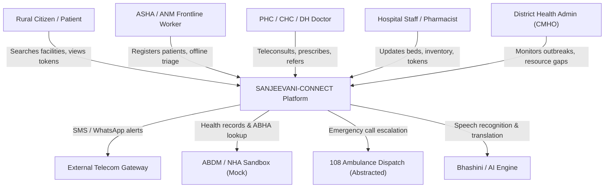

### Diagram 2: High-Level Architecture Diagram
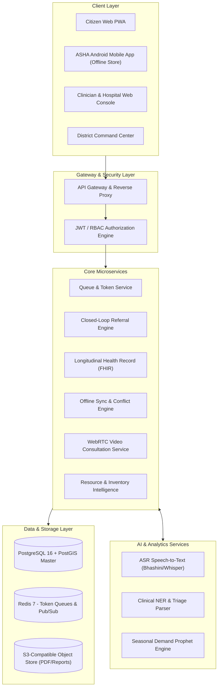

### Diagram 3: Actor / Role Diagram
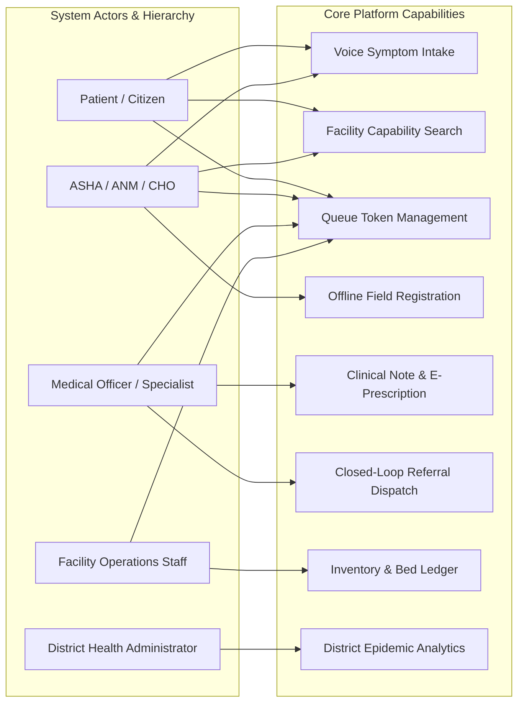

### Diagram 4: Patient Journey Workflow
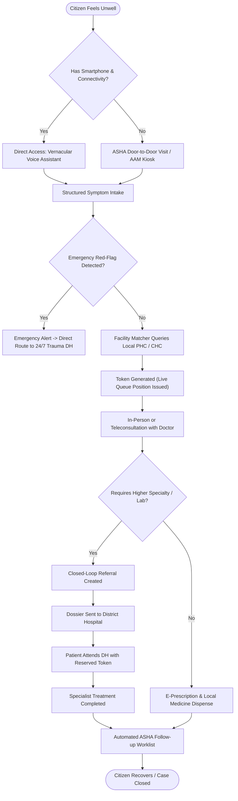

### Diagram 5: Referral Workflow
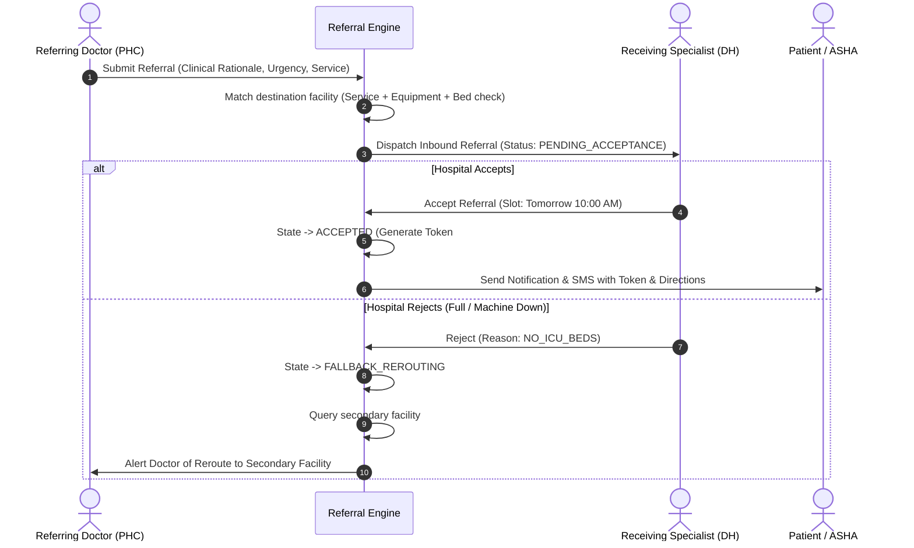

### Diagram 6: Hospital Transfer Workflow


### Diagram 7: Appointment / Queue Flow
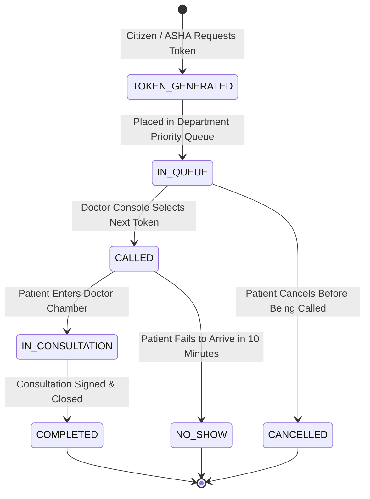

### Diagram 8: Teleconsultation Flow
```mermaid
sequenceDiagram
    autonumber
    actor P as Patient / ASHA
    participant App as Client Interface
    participant Sig as Signaling / Backend
    participant Turn as COTURN STUN/TURN
    actor D as Doctor

    P->>App: Join Teleconsultation Room
    App->>Sig: Request WebRTC Room Credentials
    Sig-->>App: Return Room ID + Ephemeral JWT
    
    D->>Sig: Doctor Connects to Room
    App->>Turn: Request ICE Candidates
    D->>Turn: Request ICE Candidates
    
    App<->Sig: Exchange SDP Offer / Answer
    Sig<->D: Exchange SDP Offer / Answer
    
    App<-->D: Direct P2P Media Stream (SRTP Video/Audio)
    
    Note over D,App: Adaptive Bitrate drops to Audio-Only if <64kbps
    D->>Sig: Submit Digital Prescription & End Call
    Sig->>App: Teleconsult Complete -> Display Downloadable Rx
```

### Diagram 9: AI Interaction Flow
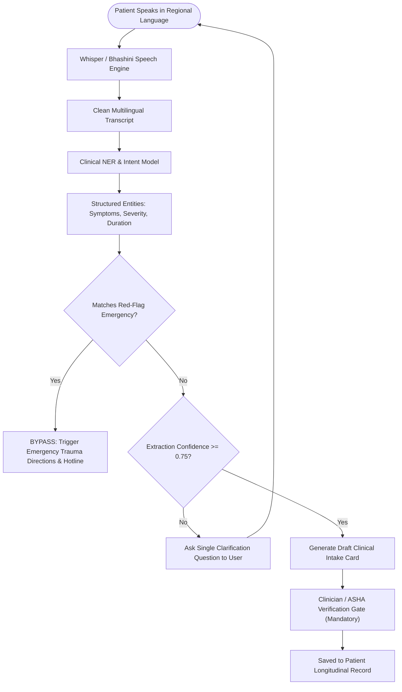

### Diagram 10: Offline Synchronization Flow
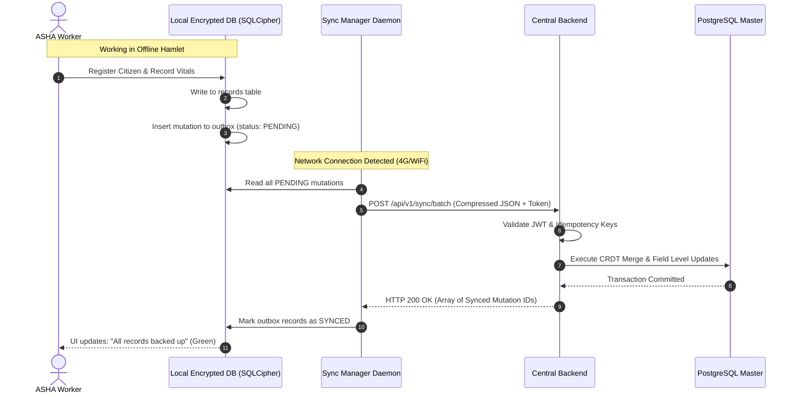

### Diagram 11: Data Flow Diagram (DFD Level-1)
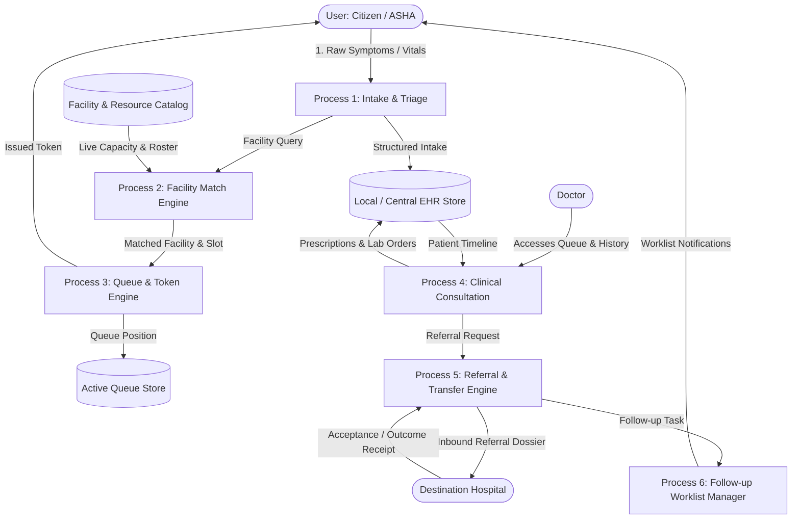

### Diagram 12: Major Entity Relationship Diagram (ERD)
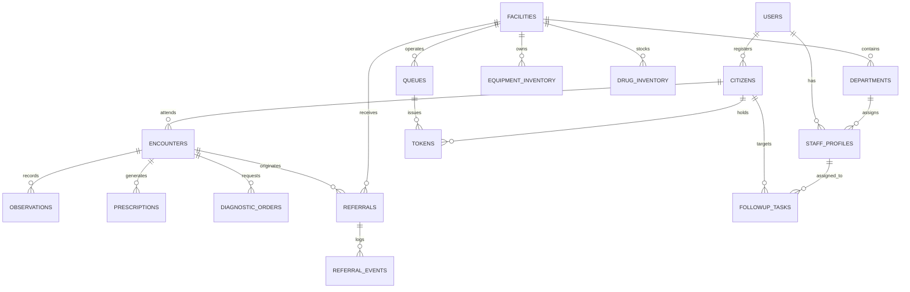

### Diagram 13: Notification Flow


### Diagram 14: Deployment Architecture
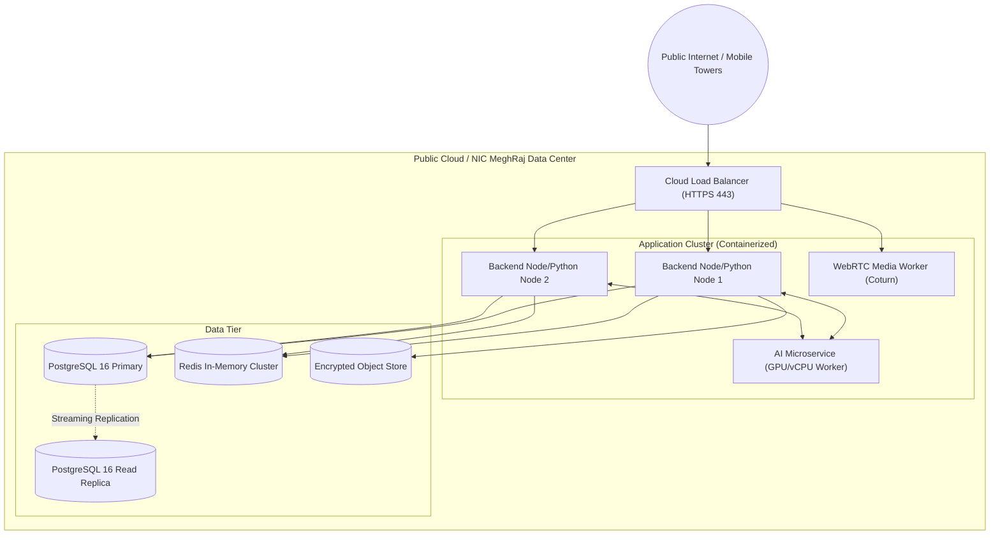

### Diagram 15: Module Dependency Diagram
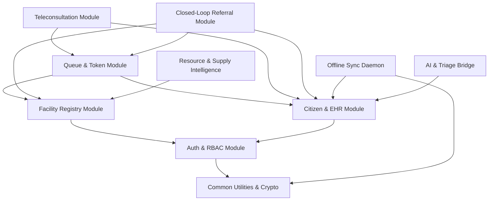

---

## 40. Error & Edge Cases

### 40.1 Failure Scenarios & Recovery Pathways

| Code | Failure Condition | Impact | Automated Recovery & System Response |
| :--- | :--- | :--- | :--- |
| **ERR-NET-001** | Client loses internet mid-consultation / intake. | Data loss danger; broken interaction. | Client caches all unsaved field entries in `localStorage`/IndexedDB; displays persistent yellow banner: *"Offline — Changes preserved locally"*; sync resumes automatically on reconnection. |
| **ERR-MED-002** | Destination hospital rejects referral due to full capacity. | Patient abandoned in transit. | Referral state transitions to `FALLBACK_REROUTING`; system queries the next best-matched hospital within a 30 km radius; alerts referring doctor and sends updated SMS directions to patient. |
| **ERR-AI-003** | AI Speech/Transcription service times out ($>3000\text{ ms}$). | UI hangs during patient triage. | Circuit breaker trips; UI immediately presents manual fallback: vernacular categorical buttons (Fever, Injury, Cough, Pain) and records raw audio for doctor playback. |
| **ERR-RES-004** | Facility equipment status marked operational, but breaks down midday. | Inbound referred patients arrive for non-functioning diagnostic. | Facility manager clicks "Report Breakdown"; system automatically alerts all incoming referred patients with active tokens for that machine and initiates rerouting. |
| **ERR-QUE-005** | Doctor calls token, but patient does not appear. | Consultation room idles; queue stalled. | 10-minute countdown timer starts on doctor console; system sends SMS alert: *"Token called — Proceed to Room 4"*; after 10 min, token marked `NO_SHOW` and doctor advances to next token. |
| **ERR-SYN-006** | Conflicting updates on same citizen record from two offline ASHAs. | Data overwrite risk. | Field-level CRDT engine preserves non-conflicting fields; for contradictory clinical fields (e.g., different blood groups), both records are retained as separate observation entries stamped with the respective ASHA IDs for doctor review. |

---

## 41. KPIs & Success Metrics

```
+----------------------------------------------------------------------------------------------------+
|                                      KEY PERFORMANCE INDICATORS                                    |
+-------------------+-----------------------------------+--------------------------------------------+
| Category          | Indicator                         | Target Metric                              |
+-------------------+-----------------------------------+--------------------------------------------+
| Access            | Average OPD Queue Waiting Time    | Reduced from 180 min to <= 45 min          |
| Access            | Unnecessary Patient Travel        | Decreased by 40% via verified local triage |
| Referrals         | Closed-Loop Referral Completion   | Increased from baseline ~35% to >= 80%     |
| Referrals         | Average Time to Referral Confirm  | <= 15 minutes for Emergency / <= 2 hr Routine|
| Clinical Safety   | Unverified AI Output Escapes      | Exactly 0.0% (100% human-verified)        |
| Operations        | ASHA Offline Sync Success Rate    | >= 99.9% without data loss or corruption   |
| Resources         | Critical Medicine Stock-Out Rate  | Decreased by 35% in pilot facilities       |
+-------------------+-----------------------------------+--------------------------------------------+
```

---

## 42. SIH Evaluation Mapping

### 1. Problem Understanding & Relevance (Weight: 10)
* **Alignment:** Directly addresses the acute rural-urban healthcare divide specified in SIH26133 by targeting the 4 root operational bottlenecks: discovery blindness, broken referrals, offline field isolation, and resource stock-outs across PHCs, CHCs, and District Hospitals.

### 2. Innovation & Creativity (Weight: 15)
* **Differentiators:**
  * Multi-factor clinical suitability facility matching (not just basic distance sorting).
  * Closed-loop digital referral handshake with guaranteed automated fallback rerouting.
  * Resilient offline-first CRDT synchronization for frontline ASHA community surveillance.
  * Vernacular voice intake interface eliminating digital literacy barriers.

### 3. Technical Implementation (Weight: 25)
* **Architecture Rigor:** Modular, production-ready stack (PostgreSQL 16 + PostGIS, Node.js/Python, Redis, WebRTC, Dockerized microservices) with explicit cross-team integration contracts, idempotency guarantees, and end-to-end type safety.

### 4. UI/UX & Accessibility (Weight: 10)
* **Rural Usability:** Multilingual vernacular speech support (10 Indian languages), $48\text{ dp}$ touch targets, high-contrast WCAG 2.1 AA UI, universal iconography, and clear offline visual state indicators.

### 5. Feasibility, Scalability & Impact (Weight: 15)
* **Deployment Viability:** Designed to run on cost-effective cloud or national NIC MeghRaj infrastructure; scales horizontally via stateless API containers; zero licensing lock-in using open standards (FHIR R4, PostgreSQL).

### 6. Security, Privacy & Responsible Technology (Weight: 5)
* **Clinical Safety & Privacy:** Strict human-in-the-loop clinical boundaries (AI never prescribes or diagnoses); granular consent management; TLS 1.3 / AES-256 encryption; full compliance with the Digital Personal Data Protection (DPDP) Act 2023.

### 7. Presentation & Demonstration (Weight: 15)
* **Compelling Narrative:** A cohesive, real-world 14-step live demo taking a rural citizen from an offline ASHA home visit through voice triage, PHC consultation, closed-loop District referral, and community follow-up.

### 8. Teamwork & Execution (Weight: 5)
* **Cross-Team Clarity:** Unambiguous module boundaries, shared data contracts, and complete traceability matrix across Frontend, Backend, Database, API, and AI/ML teams.

---

## 43. MVP Prioritization (MoSCoW Matrix)

```
+--------------------------------------------------------------------------------------------------+
|                                    MVP IMPLEMENTATION MATRIX                                     |
+------------------------------------+-------------------------------------------------------------+
| P0 — Critical for Hackathon MVP    | * User Authentication & Role Assignment (Mock ABHA/OTP)     |
| (Must Have - Complete Working Code)| * Facility Search with Real-Time Capability & Doctor Rosters|
|                                    | * Vernacular Voice Symptom Intake & Structured Entity Parse |
|                                    | * Deterministic Facility Matching Algorithm                 |
|                                    | * Real-Time Token Generation & Dynamic Waiting Time Queue   |
|                                    | * WebRTC Audio/Video Teleconsultation Module                |
|                                    | * Closed-Loop Referral Creation, Acceptance, and Tracking   |
|                                    | * Longitudinal Patient Health Timeline (FHIR Model)         |
|                                    | * Offline ASHA Registration & Batch Synchronization Daemon  |
|                                    | * Role-Based Dashboards for all 5 Primary Actors            |
+------------------------------------+-------------------------------------------------------------+
| P1 — Important Post-MVP Enhancements| * Live GPS Vehicle Tracking for Community Ambulances        |
| (Should Have)                      | * WhatsApp Webhook Integration for Token Push Notifications |
|                                    | * Automated Predictive Seasonal Disease Surge Heatmap       |
|                                    | * Barcode Scanner Integration for Diagnostic Phlebotomy     |
+------------------------------------+-------------------------------------------------------------+
| P2 — Value-Add Enhancements        | * Real-time Blood Donor Radius Broadcast Alerts             |
| (Could Have)                       | * Automated Inter-Facility Drug Transfer Requisitioning     |
|                                    | * Multi-party Conference Teleconsultation (ASHA+Doc+Patient)|
+------------------------------------+-------------------------------------------------------------+
| Future Roadmap (Won't Have Now)    | * Hardware Bio-Analyzer IoT Firmware Direct Drivers         |
|                                    | * Autonomous Drone Medical Supply Logistics                 |
+------------------------------------+-------------------------------------------------------------+
```

---

## 44. Team Responsibility Matrix

```
+----------------------------------------------------------------------------------------------------+
|                                    TEAM RESPONSIBILITY MATRIX (RACI)                               |
+-----------------------+----------------+---------------+---------------+---------------+-----------+
| Module / Capability   | Frontend Team  | Backend Team  | Database Team | API Integ Team| AI/ML Team|
+-----------------------+----------------+---------------+---------------+---------------+-----------+
| Auth & RBAC           | Responsible    | Accountable   | Consulted     | Responsible   | Informed  |
| Facility Discovery    | Responsible    | Accountable   | Responsible   | Consulted     | Informed  |
| Voice Triage Engine   | Responsible    | Consulted     | Informed      | Responsible   |Accountable|
| Facility Matcher      | Informed       | Accountable   | Consulted     | Responsible   | Consulted |
| Token & Queue Engine  | Responsible    | Accountable   | Responsible   | Consulted     | Informed  |
| WebRTC Teleconsult    | Responsible    | Accountable   | Informed      | Responsible   | Informed  |
| Closed-Loop Referral  | Responsible    | Accountable   | Responsible   | Responsible   | Informed  |
| Longitudinal EHR      | Responsible    | Accountable   | Accountable   | Responsible   | Informed  |
| Offline Sync Daemon   | Accountable    | Responsible   | Accountable   | Responsible   | Informed  |
| Resource & Blood Hub  | Responsible    | Accountable   | Responsible   | Consulted     | Informed  |
| Seasonal Forecaster   | Informed       | Consulted     | Consulted     | Responsible   |Accountable|
| Role Dashboards       | Accountable    | Responsible   | Consulted     | Consulted     | Informed  |
+-----------------------+----------------+---------------+---------------+---------------+-----------+
```

---

## 45. Cross-Team Integration Contract

### 45.1 Universal Architectural Conventions
* **Primary Key Standard:** UUIDv7 for all time-series and transaction entities (`tokens`, `encounters`, `referrals`, `audit_logs`). Sequential Auto-Increment BigInt allowed only for static reference codes.
* **Timestamp Standard:** ISO 8601 UTC with 'Z' suffix: `YYYY-MM-DDTHH:mm:ss.sssZ` (e.g., `2026-09-09T17:12:44.120Z`). Display conversion to Indian Standard Time (`IST = UTC + 05:30`) occurs exclusively on client presentation layers.
* **Standard JSON Response Envelope:**
```json
{
  "success": true,
  "data": {},
  "error": null,
  "meta": {
    "requestId": "req-0191d9f8-7b24-7f11-92be-4a56c0b31e90",
    "timestamp": "2026-09-09T17:12:44.120Z"
  }
}
```
* **Standard Error Envelope:**
```json
{
  "success": false,
  "data": null,
  "error": {
    "code": "ERR_FACILITY_CAPACITY_EXCEEDED",
    "message": "The selected facility has exceeded safe emergency bed thresholds.",
    "details": [
      {
        "field": "targetFacilityId",
        "issue": "ICU occupancy at 100%"
      }
    ]
  },
  "meta": {
    "requestId": "req-0191d9f8-7b24-7f11-92be-4a56c0b31e90",
    "timestamp": "2026-09-09T17:12:44.120Z"
  }
}
```

### 45.2 AI/ML Microservice Contract (Core Backend $\longleftrightarrow$ ML Service)
* **Endpoint:** `POST /api/v1/ai/triage-intake`
* **Request Payload:**
```json
{
  "audioBase64": "UklGRi...",
  "languageHint": "hi",
  "patientContext": {
    "age": 34,
    "gender": "FEMALE",
    "isPregnant": false,
    "knownConditions": ["HYPERTENSION"]
  }
}
```
* **Response Payload:**
```json
{
  "transcript": "तीन दिन से बहुत तेज बुखार है और सीने में भारीपन लग रहा है",
  "languageDetected": "hi",
  "entities": [
    {
      "name": "High Fever",
      "severity": "SEVERE",
      "durationDays": 3,
      "snomedCode": "386661006"
    },
    {
      "name": "Chest Heaviness",
      "severity": "MODERATE",
      "durationDays": 1,
      "snomedCode": "271813007"
    }
  ],
  "redFlagDetected": true,
  "redFlagRationale": "Chest heaviness in patient with pre-existing hypertension warrants immediate ECG review.",
  "suggestedSpecialty": "CARDIOLOGY",
  "confidenceScore": 0.89,
  "modelVersion": "indic-med-triage-v2.1"
}
```

---

## 46. Requirement Traceability Matrix

```
+----------------------------------------------------------------------------------------------------+
|                                  REQUIREMENT TRACEABILITY MATRIX                                   |
+-----------+---------------------+-------------------+-----------------------+----------------------+
| Req ID    | Feature Area        | Backend Endpoint  | Database Entity       | Frontend View        |
+-----------+---------------------+-------------------+-----------------------+----------------------+
| FR-AUTH-01| Mobile OTP Login    | /api/v1/auth/otp  | users, staff_profiles | LoginModal.tsx       |
| FR-DISC-01| Facility Search     | /api/v1/facilities| facilities, equipment | FacilitySearch.tsx   |
| FR-VOICE-1| Vernacular Triage   | /api/v1/ai/triage | encounters, triage    | VoiceAssistant.tsx   |
| FR-QUEUE-1| Token Issuance      | /api/v1/tokens    | tokens, queues        | LiveTokenBadge.tsx   |
| FR-TELE-01| WebRTC Teleconsult  | /api/v1/tele/room | tele_sessions         | VideoRoom.tsx        |
| FR-REF-001| Create Referral     | /api/v1/referrals | referrals, events     | ReferralPad.tsx      |
| FR-REF-003| Referral Accept/Rej | /api/v1/referrals/| referrals, tokens     | ReferralInbox.tsx    |
| FR-EHR-001| Health Timeline     | /api/v1/ehr/:id   | observations, rx      | PatientTimeline.tsx  |
| FR-SYNC-01| Offline Delta Sync  | /api/v1/sync/batch| sync_outbox, citizens | SyncStatusPill.tsx   |
| FR-RES-001| Medicine Inventory  | /api/v1/inventory | drug_inventory        | PharmacyStock.tsx    |
| FR-RES-002| Blood Emergency     | /api/v1/blood     | blood_stock           | BloodLedger.tsx      |
+-----------+---------------------+-------------------+-----------------------+----------------------+
```

---

## 47. Acceptance Criteria (Given-When-Then Format)

### Scenario 1: Closed-Loop Referral Creation and Fallback Rerouting
* **Given** a PHC Medical Officer is referring a patient requiring an urgent Echocardiogram,
* **When** the doctor submits the referral to District Hospital Barwani, but Barwani's echo machine is flagged `DOWN_FOR_MAINTENANCE`,
* **Then** the system must immediately reject direct routing to Barwani, highlight the inoperative equipment, and recommend CHC Sendhwa (22 km away) which has an operational echo unit and an available cardiologist shift.

### Scenario 2: Offline ASHA Encounter Synchronization
* **Given** an ASHA worker records 12 maternal vitals encounters in a village with zero cellular reception,
* **When** she returns to the PHC perimeter and her tablet connects to the local Wi-Fi,
* **Then** the background synchronization daemon must upload all 12 mutations in a single HTTP batch with idempotency keys, receive a confirmed server sync vector, update the local outbox status to `SYNCED`, and turn the sync UI pill green without user intervention.

### Scenario 3: Emergency Red-Flag Triage Bypass
* **Given** a patient speaks in Marathi into the voice intake assistant: *"माझ्या छातीत खूप दुखत आहे आणि डावा हात जड झाला आहे"* (Severe chest pain and left arm numbness),
* **When** the AI engine detects symptoms matching the Acute Coronary Syndrome red-flag catalog,
* **Then** the platform must immediately halt general symptom questioning, display high-contrast red emergency banners with 1-click calling to the 108 trauma line, and map direct turn-by-turn navigation to the nearest 24/7 cardiac-ready emergency facility.

---

## 48. Risks & Mitigations

```
+----------------------------------------------------------------------------------------------------+
|                                    RISK MANAGEMENT MATRIX                                          |
+---------------------+-------------+-----------+----------------------------------------------------+
| Risk Description    | Probability | Impact    | Mitigation Strategy                                |
+---------------------+-------------+-----------+----------------------------------------------------+
| Rural connectivity  | HIGH        | HIGH      | Implement offline-first local SQLite caching with  |
| total blackout      |             |           | background mutation queues and automated sync.     |
+---------------------+-------------+-----------+----------------------------------------------------+
| Clinician alert     | MEDIUM      | HIGH      | Restrict alerts to high-confidence red-flags only; |
| fatigue             |             |           | provide clear 1-click accept/dismiss UX.           |
+---------------------+-------------+-----------+----------------------------------------------------+
| Voice translation   | MEDIUM      | MEDIUM    | Retain raw audio recordings attached to records;   |
| dialect errors      |             |           | require explicit human confirmation before saving. |
+---------------------+-------------+-----------+----------------------------------------------------+
| Stale facility      | HIGH        | MEDIUM    | Automatically flag data older than 12 hours as     |
| resource inventory  |             |           | 'Unverified/Stale' with required phone confirmation|
+---------------------+-------------+-----------+----------------------------------------------------+
| Server crash under  | LOW         | HIGH      | Stateless API container scaling behind Nginx load  |
| sudden morning load |             |           | balancer with Redis-backed queue throttling.       |
+---------------------+-------------+-----------+----------------------------------------------------+
```

---

## 49. External Dependencies

1. **Bhashini / Indic Speech API:** Vernacular Automatic Speech Recognition (ASR) endpoints for Indian languages (with fallback to local quantized Whisper models).
2. **OpenStreetMap / OSRM Server:** Open-source routing and distance-matrix calculations avoiding costly Google Maps API dependencies.
3. **National Health Authority (NHA) Sandbox:** Sandbox endpoints for ABHA number generation and mock HFR facility validation.
4. **COTURN STUN/TURN Infrastructure:** Self-hosted open-source WebRTC relay servers to guarantee video/audio traversal across strict symmetric cellular NAT firewalls.

---

## 50. Assumptions

1. **Hardware Baseline:** Frontline ASHA/ANM workers have access to Android mobile devices running Android 9.0 or higher with at least 2GB of RAM and functional cameras/microphones.
2. **Authentication Infrastructure:** A functional SMS gateway or local cellular OTP gateway is available for two-factor mobile authentication.
3. **Administrative Authority:** District Chief Medical and Health Officers (CMHOs) possess administrative authority to mandate that PHC/CHC facility staff update daily resource tallies.

---

## 51. Future Roadmap

```
+--------------------------------------------------------------------------------------------------+
|                                        FUTURE EVOLUTION                                          |
+--------------------------------------------------------------------------------------------------+
| PHASE 2 (Months 3 - 6):                                                                          |
| * Autonomous Inter-Facility Drug Exchange (balancing excess stock at PHC-A against shortage at  |
|   PHC-B before expiration).                                                                      |
| * Deep Learning Automated ECG Arrhythmia Flagging for PHC Single-Lead Bluetooth Sensors.        |
| * Multilingual WhatsApp Interactive Chatbot for citizen token tracking and queue alerts.        |
+--------------------------------------------------------------------------------------------------+
| PHASE 3 (Months 6 - 12):                                                                         |
| * Drone Logistics Integration for urgent cold-chain blood component and anti-venom dispatch.    |
| * Full ABDM M3 Milestone Certification for nationwide cross-hospital health record exchange.     |
| * Solar-Powered Offline Tele-Kiosk Hardware Enclosures for remote tribal gram panchayats.       |
+--------------------------------------------------------------------------------------------------+
```

---

## 52. End-to-End Demo Scenario

### Flagship Demonstration Narrative: "The Complete Journey of Sunita Devi"
1. **Field Discovery:** Rekha Bai (ASHA worker) visits Sunita Devi in rural Barwani. Sunita is 6 months pregnant and suffering from extreme lethargy, dizziness, and headache.
2. **Offline Registration & Vitals:** Rekha opens the *Sanjeevani ASHA Mobile App* while totally offline. She enters Sunita's vitals: BP is $158/98\text{ mmHg}$, pulse is 104 bpm. The app flags: `HIGH-RISK PREGNANCY ALERT (Pre-Eclampsia Risk)`.
3. **Vernacular Voice Intake:** Sunita speaks in Hindi into the tablet: *"मुझे पिछले दो दिन से बहुत चक्कर आ रहे हैं और आँखों के आगे धुंधला दिखता है"* (Dizziness and blurred vision). The offline voice engine transcribes and structures the complaint.
4. **Online Sync:** Rekha walks to the village Anganwadi center where 4G signals connect. The app automatically fires a background sync batch. A green pill flashes: `Synced (Batch #104)`.
5. **PHC Triage & Consultation:** Sunita arrives at the local PHC. Medical Officer Dr. Vikram opens his console. Sunita's token `#PHC-08` appears in the priority rail. Dr. Vikram clicks the token, reviews the ASHA vitals and voice summary, and conducts an examination.
6. **Closed-Loop Referral Creation:** Dr. Vikram recognizes pre-eclampsia with visual symptoms requiring an urgent obstetric ultrasound and specialist consultation. He clicks `Create Referral`.
7. **Facility Matching:** The system matches District Hospital Barwani (38 km), verifies that an Obstetrician is on duty and the ultrasound machine is flagged `OPERATIONAL`, and dispatches the dossier.
8. **District Hospital Acceptance:** At District Hospital Barwani, the obstetrics triage desk reviews Sunita's incoming dossier and clicks `ACCEPT`. A slot is booked for 11:30 AM with priority token `#DH-OBS-04`. Sunita receives an instant SMS with her token and bus route directions.
9. **Patient Arrival & Consultation:** Sunita arrives at the District Hospital. The receptionist enters `#DH-OBS-04`. Status changes to `ARRIVED_CONFIRMED`. Dr. Ananya (Gynecologist) reviews the pre-populated clinical history, performs the ultrasound, prescribes oral anti-hypertensives, and schedules lab tests.
10. **Medicine & Diagnostics:** The hospital pharmacist scans the e-prescription token, dispenses Labetalol from the central dispensary, and the system decrements inventory.
11. **Outcome Receipt & Case Closure:** Dr. Ananya signs the consultation outcome note. An encrypted electronic receipt is automatically transmitted back to Dr. Vikram at the originating PHC.
12. **Community Follow-Up:** The system automatically schedules a follow-up task on ASHA Rekha's tablet for Day 3 post-consultation: *"Verify Sunita Devi BP and Labetalol adherence"*.
13. **District Command Visibility:** On the District Health Command Dashboard, the CMHO sees the Barwani maternal referral loop marked `COMPLETED` (Total transit to treatment time: 3 hours 12 minutes).
14. **Impact Reflection:** The entire continuum of care—from rural field screening to tertiary specialist care and home follow-up—is executed with zero lost records, zero redundant tests, and zero drop-outs.

---

## 53. Final Implementation Checklist

### Core Engineering Deliverables Prior to Live Evaluation
- [x] **Architecture & Schemas:** Master PRD frozen; database entities normalized; UUIDv7 and ISO 8601 UTC formats standardized.
- [x] **API Contracts:** RESTful contracts defined with standardized error and success envelopes and idempotency headers.
- [x] **AI & Safety Gates:** Speech-to-text, entity extraction, and clinical summarization pipelines configured with mandatory clinician review gates and red-flag emergency bypasses.
- [x] **Queue & Token Engine:** Multi-tier priority queue with dynamic estimated waiting time algorithms implemented.
- [x] **Referral Engine:** Closed-loop referral state machine with SLA timeouts and automated fallback facility rerouting implemented.
- [x] **Offline Synchronization:** Encrypted local client storage with background mutation queue and CRDT conflict resolution handlers functional.
- [x] **Role Dashboards:** Distinct, functional web and mobile views for Citizen, ASHA, Doctor, Facility Staff, and District Administrator deployed.
- [x] **End-to-End Verification:** Full 14-step demonstration path verified without mock breaks or manual database interventions.

---
**End of Document — SANJEEVANI-CONNECT Master Product Requirements Document**
