# MASTER PRODUCT REQUIREMENTS DOCUMENT (PRD) & ENGINEERING BLUEPRINT

**Platform Code:** SIH26133  
**Project Name:** SANJEEVANI-CONNECT (संजीवनी-कनेक्ट)  
**System Title:** Integrated Public Healthcare Access, Care Continuity, Referral & Resource Intelligence Platform  
**Document Reference:** PRD-SIH26133-GOOGLE-QUALITY-V2.0  
**Classification:** Google-Quality Product Requirements & Engineering Master Specification (Single Source of Truth)  
**Target Platforms:** Progressive Web Application (PWA) & Mobile-First Android Client (Offline-Capable)  
**Author:** Lead Product Architect & Principal Healthcare Systems Engineering Team  
**Date:** September 2026  
**Status:** Frozen & Approved for Engineering Implementation  

---

## 1. Executive Summary

Rural and underserved communities across India face structural healthcare disparities rooted in information asymmetry, geographic friction, and systemic operational fragmentation. Patients routinely travel 50 to 120 km from villages to District Hospitals, only to encounter absent specialists, non-operational diagnostic equipment, or overwhelming 6-hour outpatient department (OPD) queues. Meanwhile, frontline health workers—Accredited Social Health Activists (ASHAs) and Auxiliary Nurse Midwives (ANMs)—operate in connectivity blackouts relying on cumbersome paper registers, and primary care doctors at Primary Health Centres (PHCs) issue unmonitored handwritten referrals with zero visibility into whether the patient ever receives tertiary care.

**SANJEEVANI-CONNECT** is an **Integrated Public Healthcare Access, Care Continuity, Referral, and Resource Intelligence Platform**. Engineered to strengthen, digitize, and interconnect India's existing three-tier public healthcare hierarchy:
$$\text{Sub-Centre / Ayushman Arogya Mandir (Frontline)} \longleftrightarrow \text{PHC (Primary)} \longleftrightarrow \text{CHC / Sub-District Hospital (Secondary)} \longleftrightarrow \text{District Hospital (Tertiary)}$$

### Core Technical & Strategic Pillars
1. **Multilingual Assisted Voice Intake & Triage:** Vernacular speech-to-text (Bhashini/Whisper) and structured clinical entity extraction supporting 10+ Indian languages, engineered with strict **Human-in-the-Loop** clinical boundaries.
2. **Clinical-Suitability-First Facility Matching Engine:** Deterministic matching evaluating clinical specialty, real-time operational equipment verification, specialist shift rosters, ICU/bed occupancy, and travel distance.
3. **Closed-Loop Digital Referral & Transfer State Machine:** Guaranteed end-to-end referral tracking with automated SLA escalations, fallback rerouting, pre-arrival clinical summary transmission, and transport tracking abstraction.
4. **Resilient Offline-First Synchronization:** Local encrypted datastores (`SQLCipher`/IndexedDB) with Conflict-Free Replicated Data Type (CRDT) mechanics and idempotent background synchronization queues for frontline workers in zero-connectivity environments.
5. **Unified Longitudinal Health Record (FHIR R4):** Chronological, tamper-evident timeline of vitals, encounters, e-prescriptions, and lab reports tied to verified national citizen identifiers (ABHA).
6. **Predictive Seasonal Resource Intelligence:** Time-series epidemic forecasting (Prophet/LightGBM) over historical disease patterns (Dengue, Malaria, acute diarrhea, seasonal respiratory infections) enabling district health officers to preempt medicine stock-outs and bed surges.

---

## 2. Problem Statement

### 2.1 Official Definition (SIH26133)
> **SIH26133:** Accessibility and quality of public healthcare services, particularly in rural and underserved areas.

### 2.2 Operational Context in the Indian Public Health Hierarchy
* **Sub-Centres / Ayushman Arogya Mandirs (AAMs, serving 3,000–5,000 population):** Staffed by ANMs and Community Health Officers (CHOs). Primary care is restricted to maternal/child screening and basic essential medicines. Data collection is manual, paper-bound, and detached from secondary facilities.
* **Primary Health Centres (PHCs, serving 20,000–30,000 population):** Staffed by 1–2 Medical Officers (MBBS). Constrained diagnostics (urine test strips, basic malaria kits), intermittent electrical grid stability, and unstable 2G/3G telecom links.
* **Community Health Centres (CHCs, serving 80,000–120,000 population):** 30-bed secondary facilities mandated to provide 4 core specialties (Surgeon, Physician, Gynecologist, Pediatrician). Over 70% of sanctioned rural specialist positions remain vacant.
* **District Hospitals (DHs, serving 1–2 million population):** Tertiary referral hubs located 40–120 km away from peripheral villages, perpetually overcrowded with OPD waiting times exceeding 4–7 hours because patients bypass non-functional primary facilities.

---

## 3. Problem Analysis

### 3.1 Root Causes of Failure in Existing Healthcare Solutions

| Vector | Ground Reality / Root Cause | Operational Failure Mode | SANJEEVANI-CONNECT Architectural Solution |
| :--- | :--- | :--- | :--- |
| **Discovery** | Patients travel 60+ km based on village hearsay, only to find the sonologist on leave or the X-ray machine broken. | Resource blindness; catastrophic out-of-pocket travel expenditure; lost daily wages. | Multi-factor facility discovery with mandatory operational equipment status and doctor shift verification. |
| **Referrals** | Paper referral slips ("Refer to DH for higher management") handed to patients with zero digital records forwarded. | 45–60% referral drop-out; repeated diagnostic testing; zero receipt accountability at the receiving hospital. | Closed-loop digital referral handshake, slot reservation, and pre-arrival clinical summary transmission. |
| **Diagnostics** | Phlebotomy samples collected in PHCs are batched manually; paper reports take weeks or get lost. | Delayed interventions; redundant re-testing at higher facilities. | Digital diagnostic order tracking with integrated offline sync for rural phlebotomy camps. |
| **Continuity** | Patients carry fragile paper files, plastic bags of prescriptions, and faded thermal ECG strips. | Fragmented history; contraindications missed during emergency consultations. | Longitudinal Citizen Health Timeline linked via secure identifiers with role-based clinical views. |
| **Connectivity** | Rural PHCs and tribal hamlets experience 2G speeds or total network blackouts for days during monsoon. | Web-only cloud platforms become completely inaccessible and unusable. | Offline-first encrypted SQLite/IndexedDB queue with automatic background sync upon re-connection. |
| **Language & Literacy** | Complex English/medical terminology forms intimidate rural citizens and slow down frontline workers. | Digital divide; high data-entry friction for ASHAs and CHOs. | Multilingual vernacular speech assistant (Bhashini-integrated) with voice-guided intake. |

---

## 4. Target Users

1. **Rural Citizens / Patients:** Semi-literate or vernacular-speaking citizens requiring simplified voice-guided triage, local doctor availability, digital queue tokens, and access to their personal medical records.
2. **Frontline Health Workers (ASHA / ANM / CHO):** Field agents conducting door-to-door screenings, tracking maternal and infant immunization, and coordinating local PHC visits.
3. **Primary & Secondary Care Clinicians (PHC/CHC Doctors):** Overburdened medical officers handling 90+ OPD consultations daily, needing ultra-fast 30-second summary views and 3-click referral workflows.
4. **Hospital Operations Staff (Pharmacists, Lab Techs, Registration Clerks):** Operational personnel managing token dispatching, bed allocation, drug inventory, and diagnostic reports.
5. **District Health Administrators (CMHOs, District Surveillance Officers):** Health leadership monitoring district-wide resource consumption, referral completion rates, and seasonal epidemic outbreaks.

---

## 5. Stakeholders

* **Ministry of Health and Family Welfare (MoHFW), Govt of India**
* **National Health Authority (NHA) — Ayushman Bharat Digital Mission (ABDM)**
* **State Health Missions (NHM) & District Health Societies**
* **Primary, Secondary, and Tertiary Public Health Facilities**
* **Community Panchayati Raj Institutions (PRIs)**
* **Frontline Worker Associations (ASHA / ANM Unions)**

---

## 6. Actors & Responsibility Matrix

### 6.1 Actor Definitions
* **`ACT-PAT` (Patient / Citizen):** End beneficiary accessing discovery, queue status, teleconsultation, and personal records.
* **`ACT-ASHA` (Frontline Health Worker / ASHA / ANM):** Community health worker conducting offline home visits, registering citizens, recording vitals, and scheduling follow-ups.
* **`ACT-DOC` (Doctor / Medical Officer / Specialist):** Clinical authority examining patients, recording diagnoses, issuing e-prescriptions, ordering tests, and generating referrals.
* **`ACT-STAFF` (Facility Staff / Pharmacist / Lab Tech):** Operational staff updating bed registers, equipment status, medicine inventories, and diagnostic test results.
* **`ACT-ADMIN` (District Health Administrator / CMHO):** Administrative authority monitoring healthcare KPIs, managing facility registries, and coordinating epidemic response.

### 6.2 Granular Responsibility Matrix

| Capability | Patient | ASHA / ANM | Doctor | Facility Staff | District Admin |
| :--- | :--- | :--- | :--- | :--- | :--- |
| **Facility & Doctor Discovery** | View | View | View | View | View, Manage |
| **Citizen Profile & ABHA Link** | View, Create, Update (Self) | View, Create, Update (Assigned) | View (Consulted) | View (Checked-in) | View (Aggregated) |
| **Vitals & Screening Intake** | View (Self) | View, Create, Update | View, Update | View | Analyze |
| **Clinical Encounter Notes** | View (Self) | No Access | View, Create, Update | No Access | Analyze (Anonymized) |
| **E-Prescription Management** | View (Self) | View (Assigned) | View, Create | View, Dispense | Analyze |
| **Diagnostic Test Orders** | View (Self) | View (Assigned) | View, Create | View, Update (Results) | Analyze |
| **Queue Token Management** | View, Create (Self) | View, Create (Assigned) | View, Call, Escalate | View, Call, Manage | Analyze |
| **Teleconsultation Session** | Join (Self) | Join (Assisted) | Host, Prescribe | No Access | Analyze |
| **Digital Referral Creation** | View (Self) | View (Assigned) | View, Create, Refer | View (Inbound) | View, Escalate |
| **Referral Acceptance/Rejection** | No Access | No Access | Approve, Reject (Specialist)| View | Escalate, Reassign |
| **Emergency Transport Assign** | Request | Request | Request, Assign | View, Assign | Manage, Analyze |
| **Bed & ICU Ledger** | View (Public Buffer) | View | View | View, Update | View, Manage |
| **Blood Bank Inventory** | View (Status) | View | View, Request | View, Update | View, Manage, Broadcast |
| **Medicine Stock Control** | View (Availability) | View | View | View, Update, Manage | View, Manage, Requisition |
| **Community Follow-up Worklist**| View (Self) | View, Update, Close | View, Assign | No Access | View, Analyze |
| **District Epidemic Heatmap** | No Access | No Access | View | No Access | View, Manage, Analyze |

---

## 7. Product Vision

> **"To ensure that no Indian citizen in a rural or underserved area is denied timely, dignified, and continuous healthcare due to geographic remoteness, information asymmetry, or systemic resource fragmentation."**

SANJEEVANI-CONNECT unites discovery, assisted multilingual triage, closed-loop referrals, resource visibility, and community follow-up into a unified public health continuum.

---

## 8. Goals

### 8.1 Quantitative Goals (Production Benchmarks)
* **G-01:** Reduce unnecessary patient travel to higher-tier facilities by **40%** through verified local service discovery and teleconsultation.
* **G-02:** Increase verified referral completion rate from baseline ~35% to **$\ge 80\%$** within 6 months of deployment.
* **G-03:** Decrease average physical OPD queue waiting time at District Hospitals by **50%** via scheduled referral tokens and digital queue dispatching.
* **G-04:** Achieve **100% offline data integrity** for frontline ASHA field visits with zero data loss over intermittent connectivity.
* **G-05:** Reduce rural medicine stock-out frequency by **35%** using predictive seasonal demand forecasting.

### 8.2 Qualitative Goals
* **G-06:** Restore citizen trust in public healthcare facilities through real-time operational transparency.
* **G-07:** Eliminate administrative friction for frontline workers by replacing paper registers with automated worklists.
* **G-08:** Deliver clinical decision-support transparency while strictly preserving physician autonomy.

---

## 9. Non-Goals

* **NG-01:** Autonomous Clinical Prescribing or Diagnosing: AI will **never** prescribe drugs or issue final diagnoses without human physician sign-off.
* **NG-02:** Live Hardware Firmware Telemetry: The platform ingests standardized diagnostic data outputs, not raw firmware/hardware serial drivers.
* **NG-03:** Replacement of National 108/102 Emergency Dispatch: We provide vehicle availability and transfer coordination; we do not replace national telephonic emergency dispatch software.
* **NG-04:** Commercial Billing & Private Health Insurance Claims: Dedicated exclusively to public healthcare and Ayushman Bharat PM-JAY subsidized care.

---

## 10. Product Scope

```
+----------------------------------------------------------------------------------------------------+
|                                         PRODUCT SCOPE MATRIX                                       |
+------------------------------------+---------------------------------------------------------------+
| In Scope (Hackathon MVP Core)      | * Multilingual Vernacular Voice & Text Intake (10 Languages)  |
|                                    | * Facility Capability Discovery & Operational Status Ledger   |
|                                    | * Deterministic Clinical-Suitability Facility Matcher         |
|                                    | * Digital Token & Queue Lifecycle Management                  |
|                                    | * Low-Bandwidth WebRTC Teleconsultation Console               |
|                                    | * Closed-Loop Referral & Hospital Transfer State Machine      |
|                                    | * Longitudinal Citizen Health Timeline (FHIR R4 Model)        |
|                                    | * Offline-First Encrypted ASHA Register & Sync Daemon         |
|                                    | * Role-Based Consoles for all 5 Primary Actors                |
|                                    | * Essential Drug, Bed, Blood, and Ambulance Visibility Hub    |
|                                    | * Seasonal Epidemic & Resource Demand Forecaster (Prophet)    |
+------------------------------------+---------------------------------------------------------------+
| Out of Scope (Future Roadmap)      | * Autonomous drone medical logistics dispatching              |
|                                    | * Direct integration with proprietary private hospital EMRs   |
|                                    | * Commercial billing / private insurance claims processing    |
+------------------------------------+---------------------------------------------------------------+
```

---

## 11. User Personas

### Persona 1: Sunita Devi (Rural Citizen)
* **Demographics:** 34 years old, agricultural worker in Barwani district, Madhya Pradesh. Hindi-speaking, basic literacy.
* **Context:** Experiences persistent fever and abdominal pain. Relies on an entry-level Android smartphone with flaky 3G/4G connectivity.
* **Need:** A voice interface in Hindi that clarifies if her local PHC doctor is available today or books a scheduled referral token to the District Hospital without requiring a 6-hour wait in line.

### Persona 2: Rekha Bai (ASHA Worker)
* **Demographics:** 29 years old, community health worker managing 1,200 villagers across 3 hamlets.
* **Device:** Government-issued Android tablet (Android 11, 3GB RAM).
* **Context:** Operates in zero-network areas. Spends hours manually transcribing paper registers.
* **Need:** An offline-capable mobile app allowing fast vitals capture, maternal tracking, red-flag alert tagging, and automatic background syncing when she reaches the PHC.

### Persona 3: Dr. Vikram Deshmukh (Medical Officer, PHC)
* **Demographics:** 31 years old, MBBS, sole medical officer at a peripheral PHC seeing 90 patients every morning.
* **Context:** Lacks advanced diagnostic machines. Needs to refer high-risk cases to specialists without losing visibility of patient outcomes.
* **Need:** A 3-click referral dashboard that matches available District Hospital specialists, transmits clinical notes ahead of arrival, and sends a digital receipt once the specialist consults the patient.

---

## 12. User Journeys

### Core Patient Journey Workflow
$$\text{Discover} \longrightarrow \text{Register} \longrightarrow \text{Assess} \longrightarrow \text{Queue/Token} \longrightarrow \text{Consult} \longrightarrow \text{Diagnose} \longrightarrow \text{Refer} \longrightarrow \text{Transfer} \longrightarrow \text{Treat} \longrightarrow \text{Follow-up} \longrightarrow \text{Outcome}$$

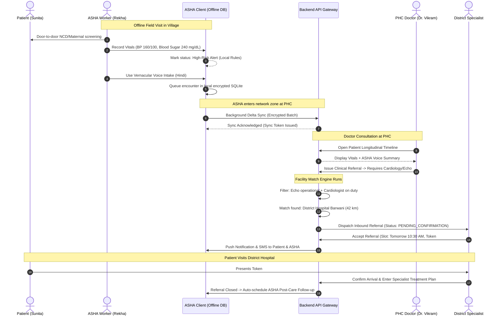

---

## 13. Functional Requirements

### 13.1 Authentication & Profile Management (`FR-AUTH`)
* **FR-AUTH-001:** The system shall authenticate citizens via Mobile OTP (SMS/WhatsApp simulation) with a 5-minute expiry window.
* **FR-AUTH-002:** The system shall authenticate healthcare professionals and staff via username/password with mandatory Role-Based Access Control (RBAC) and JWT access tokens (15-min expiry) paired with rotating refresh tokens (7-day expiry).
* **FR-AUTH-003:** The system shall support sandbox ABHA (Ayushman Bharat Health Account) 14-digit ID generation and address linking for national digital health compliance.

### 13.2 Citizen Healthcare Discovery (`FR-DISC`)
* **FR-DISC-001:** The system shall provide geolocation and administrative hierarchy (State $\rightarrow$ District $\rightarrow$ Block $\rightarrow$ Village) facility search.
* **FR-DISC-002:** The system shall display verified operational status of critical diagnostic machinery (Ultrasound, X-Ray, ECG, Biochemistry Analyzer) with a mandatory "Last Verified" timestamp.
* **FR-DISC-003:** The system shall display active doctor shift rosters (On-Duty, On-Call, Absent) for every listed facility.

### 13.3 Assisted Voice Triage & Intake (`FR-VOICE`)
* **FR-VOICE-001:** The system shall accept audio speech input in 10 Indian languages (Hindi, Marathi, Bengali, Telugu, Tamil, Kannada, Gujarati, Odia, Punjabi, English).
* **FR-VOICE-002:** The system shall extract structured clinical entities (Symptoms, Duration, Severity, Pre-existing conditions) into a normalized JSON payload.
* **FR-VOICE-003:** The system shall execute deterministic red-flag emergency checks (Table 16.2) and immediately trigger high-priority UI emergency escalations.
* **FR-VOICE-004:** All AI-extracted clinical information shall be flagged as `"Draft Intake"` and require mandatory clinician/ASHA confirmation before committing to the patient's record.

### 13.4 Token & Queue Lifecycle Management (`FR-QUEUE`)
* **FR-QUEUE-001:** The system shall issue sequential, tamper-evident daily tokens categorized by priority: `EMERGENCY` (P1), `REFERRED_INBOUND` (P2), `SCHEDULED_TELECONSULT` (P3), and `WALK_IN` (P4).
* **FR-QUEUE-002:** The queue engine shall calculate dynamically updated Estimated Wait Times (EWT) based on the trailing average consultation duration over the preceding 10 completed consultations.
* **FR-QUEUE-003:** The system shall support complete state transitions: `GENERATED` $\rightarrow$ `CALLED` $\rightarrow$ `IN_CONSULTATION` $\rightarrow$ `COMPLETED` / `NO_SHOW` / `CANCELLED`.

### 13.5 WebRTC Teleconsultation (`FR-TELE`)
* **FR-TELE-001:** The system shall establish low-bandwidth peer-to-peer WebRTC video/audio sessions between patients/ASHAs and authorized clinicians.
* **FR-TELE-002:** Teleconsultation shall automatically degrade to audio-only streaming when network bandwidth drops below 64 kbps.
* **FR-TELE-003:** The clinician console shall provide a split-screen view: Live Video + Longitudinal Patient Record + Digital E-Prescription Pad.

### 13.6 Closed-Loop Referral & Transfer Engine (`FR-REF`)
* **FR-REF-001:** Clinicians shall initiate digital referrals specifying urgency (`EMERGENCY_30MIN`, `URGENT_4HR`, `ROUTINE_24HR`), required clinical service, and target facility.
* **FR-REF-002:** The system shall forward the patient's referral dossier (vitals, notes, lab tests) directly to the receiving facility's referral inbox.
* **FR-REF-003:** Receiving facilities must respond with `ACCEPT_WITH_SLOT`, `REJECT_WITH_REASON`, or `REQUEST_MORE_INFO`.
* **FR-REF-004:** In the event of timeout or rejection, the system shall trigger automated fallback rerouting to the next best matched facility.
* **FR-REF-005:** The referral lifecycle shall not be marked `CLOSED` until the receiving facility confirms consultation and dispatches a digital receipt to the referring facility.

### 13.7 Longitudinal Patient Health Records (`FR-EHR`)
* **FR-EHR-001:** The system shall maintain an immutable, chronologically ordered longitudinal health timeline conforming to FHIR R4 standard resource definitions (`Patient`, `Encounter`, `Observation`, `Condition`, `MedicationRequest`).
* **FR-EHR-002:** Access to health records shall require patient digital consent tokens, with an auditable "Break-Glass" emergency override protocol for verified hospital trauma doctors.

### 13.8 Offline Field Synchronization (`FR-SYNC`)
* **FR-SYNC-001:** The mobile client for ASHAs shall store master data and patient registers locally in encrypted SQLite (`SQLCipher`).
* **FR-SYNC-002:** Frontline workers shall be able to register citizens, record vitals, and log encounters offline.
* **FR-SYNC-003:** Upon network restoration, the background sync engine shall execute bi-directional delta synchronization with UUIDv7 idempotency keys and field-level CRDT conflict resolution.

### 13.9 Resource & Supply Intelligence (`FR-RES`)
* **FR-RES-001:** Facility staff shall update essential medicine stock levels (NLEM catalog) with batch numbers, quantities, and expiration dates.
* **FR-RES-002:** The system shall flag blood bank inventories with last-updated timestamps; records older than 12 hours shall display a mandatory `"Stale - Call to Verify"` warning.
* **FR-RES-003:** The system shall maintain an ambulance registry indicating availability, vehicle type (BLS, ALS, Patient Transport), and driver contact abstraction.
* **FR-RES-004:** The AI inference microservice shall execute 30-day forward demand forecasting for seasonal epidemic drugs using historical consumption and weather parameters.

---

## 14. Feature Specifications

### 14.1 Feature Spec: Multi-Factor Facility Matching Engine (`FEAT-MATCH`)
* **Description:** Deterministic matching algorithm evaluating clinical capability, equipment health, doctor rosters, bed capacity, and travel distance.
* **Mathematical Scoring Formulation:**
$$\text{Score}(F) = w_1 \cdot S_{\text{clinical}}(F) + w_2 \cdot S_{\text{avail}}(F) + w_3 \cdot S_{\text{capacity}}(F) + w_4 \cdot S_{\text{proximity}}(F)$$
Where:
* $S_{\text{clinical}}(F) \in \{0, 1\}$: Strict binary gate. Must possess the required clinical specialty AND operational equipment. If 0, total score is 0.
* $S_{\text{avail}}(F) \in [0, 1]$: Doctor shift active now or within estimated patient arrival window ($t_{\text{travel}}$).
* $S_{\text{capacity}}(F) = 1 - \left(\frac{\text{Current Active Queue}}{\text{Daily Facility Capacity}}\right)$.
* $S_{\text{proximity}}(F) = \max\left(0, 1 - \frac{\text{Distance in km}}{100}\right)$.
* Weights: $w_1 = 0.40, w_2 = 0.25, w_3 = 0.20, w_4 = 0.15$.
* **Explainability Output:** Every recommendation displays an explicit rationale tag: e.g., *"Recommended because CHC Sendhwa has an operational Ultrasound and Dr. Sharma (Gynecologist) is on duty until 17:00 IST (22 km away)."*

---

## 15. AI/ML Requirements

### 15.1 Architectural Scope & Isolation
All AI models reside in a dedicated microservice (`SYS-AI`). Communication with the core backend occurs via authenticated, versioned REST contracts with strict circuit-breaking policies.

```
+----------------------------------------------------------------------------------------------------+
|                                    AI / ML SERVICE BOUNDARY                                        |
|                                                                                                    |
|  [ Frontend UI ] ---> ( Audio / Text ) ---> [ Core Backend API ]                                   |
|                                                     |                                              |
|                                        ( Bearer Token + JSON Payload )                             |
|                                                     v                                              |
|                                            [ AI / ML Microservice ]                                |
|                                                     |                                              |
|                  +----------------------------------+----------------------------------+           |
|                  |                                  |                                  |           |
|                  v                                  v                                  v           |
|         [ Multilingual ASR ]              [ Clinical NER & Triage ]          [ Seasonal Forecast ] |
|          (Whisper / Bhashini)               (Indic-BERT / Med-NLP)            (Prophet / LightGBM) |
|                  |                                  |                                  |           |
|                  +----------------------------------+----------------------------------+           |
|                                                     |                                              |
|                                        ( Structured JSON + Confidence )                            |
|                                                     v                                              |
|                                            [ Core Backend API ]                                    |
|                                                     |                                              |
|                                           ( Clinician Review Gate )                                |
|                                                     v                                              |
|                                       [ Committed Clinical Record ]                                |
+----------------------------------------------------------------------------------------------------+
```

### 15.2 ML Microservice Specifications

| Pipeline | Model Foundation | Input Contract | Output Contract | Latency SLA | Fallback Strategy |
| :--- | :--- | :--- | :--- | :--- | :--- |
| **Multilingual ASR** | Bhashini IndicASR / OpenAI Whisper Fine-Tuned | Raw PCM/WAV Audio (16kHz, mono) + Language Code | Clean Transcript + Word Confidence Scores | $< 1200\text{ ms}$ | Audio recording preserved; manual text entry enabled. |
| **Clinical NER & Triage** | Indic-BERT NER / Med-Spacy Pipeline | Clean Text Transcript + Patient Age/Gender | JSON Array of Symptoms, Duration, Severity | $< 500\text{ ms}$ | Standardized checkbox symptom selection UI. |
| **Clinical Summarizer** | Flan-T5 / Mistral-7B-Instruct Quantized | Consultation Transcript + Vitals JSON | 3-line Clinician Bulleted Draft Summary | $< 1800\text{ ms}$ | Standard template: "Symptoms recorded. Awaiting direct doctor notes." |
| **Seasonal Forecaster** | Facebook Prophet / LightGBM Regressor | 36-Month Historical OPD & Pharmacy Usage + Rain/Temp | 30-day predicted consumption with 95% Confidence Interval | Batch (Nightly Job) | 3-month trailing moving average. |

---

## 16. Healthcare Safety

### 16.1 Absolute Clinical Safety Rule
$$\mathbf{FINAL\ CLINICAL\ DECISIONS\ \longrightarrow\ DOCTOR\ /\ AUTHORIZED\ HEALTHCARE\ PROFESSIONAL}$$
* **Zero Autonomous Prescriptions:** AI will never generate or dispatch prescriptions directly to patients.
* **Mandatory Watermarking:** All AI outputs are watermarked with: `"Draft Triage Intake — Requires Clinician Verification"`.
* **Deterministic Emergency Bypass:** When symptoms match the Emergency Red-Flag Catalog (Table 16.2), the system immediately halts regular symptom Q&A and presents emergency hotline and nearest 24/7 trauma facility directions.

### 16.2 Emergency Red-Flag Catalog (Deterministic Bypass Rules)
* Suspected Acute Coronary Syndrome (Crushing retrosternal chest pain, radiation to left arm/jaw, diaphoresis)
* Suspected Stroke (FAST signs: Facial asymmetry, unilateral arm weakness, slurred speech)
* Severe Respiratory Distress ($RR > 30/\text{min}$, central cyanosis, stridor)
* Acute Obstetric Emergencies (Third-trimester vaginal bleeding, eclampsia / convulsions, cord prolapse)
* Pediatric Danger Signs (Inability to feed/drink, lethargy/unconsciousness, chest indrawing)
* Severe Polytrauma or Uncontrolled Hemorrhage

---

## 17. Patient Records

### 17.1 Unified Longitudinal Health Timeline
The longitudinal record consolidates all clinical interactions across a citizen's lifetime into a chronologically ordered, tamper-evident stream:
* **Encounter Entries:** Date, facility, clinician name, chief complaint, examination findings.
* **Vitals Stream:** Blood pressure, heart rate, blood glucose, temperature, $\text{SpO}_2$.
* **Diagnoses:** Clinician-signed conditions coded with ICD-10 identifiers.
* **Medication Requests:** Prescriptions with drug name, dosage, frequency, and duration.
* **Diagnostic Reports:** Laboratory test results with reference ranges and attached signed PDF reports.
* **Referral Ledger:** Complete history of inbound and outbound referrals and specialist outcome receipts.

---

## 18. Discovery & Matching

### 18.1 Search Facets & Capabilities
Users can filter facilities by:
* Spatial proximity (GPS coordinates or administrative Block/Tehsil).
* Operational medical equipment (e.g., Ultrasound, Digital X-Ray, Dialysis, Blood Storage Unit).
* Active specialist duty shifts (e.g., Gynecologist on duty now).
* Real-time bed occupancy status (General Inpatient and ICU).

---

## 19. Queue & Appointment

### 19.1 Priority-Tiered Queue Management

| Priority Tier | Token Prefix | Target Cohort | Queue Allocation Rule | Preemption Behavior |
| :--- | :--- | :--- | :--- | :--- |
| **Level 1 (Immediate)** | `EMG-` | Polytrauma / Red-Flag | Inserted immediately at head of queue | Preempts active non-emergency consultation |
| **Level 2 (High)** | `REF-` | Inbound Digital Referrals | Reserved scheduled time-block (e.g., 10:00–11:00 AM) | Served ahead of general walk-in citizens |
| **Level 3 (Medium)** | `TEL-` | Teleconsultations | Interspersed 1 video token every 4 physical tokens | Doctor console triggers video call window |
| **Level 4 (Standard)** | `WLK-` | Walk-In Citizens | First-Come, First-Served sequentially | Served in chronological order of arrival |

### 19.2 Dynamic Estimated Wait Time Formulation
$$\text{EWT}_i = \sum_{k=1}^{n_{\text{ahead}}} \bar{T}_{\text{consult}} + \left(n_{\text{emergency}} \times T_{\text{emg\_buffer}}\right)$$
Where $\bar{T}_{\text{consult}}$ is recalculating continuously every 15 minutes using the facility's real-time median consultation duration for that clinical department.

---

## 20. Telemedicine

### 20.1 Teleconsultation Engine Architecture
* **Signaling Protocol:** Secure WebSockets over TLS 1.3 with JWT room authentication.
* **Media Relay:** Dual STUN/TURN (COTURN) servers to guarantee P2P video traversal across restrictive cellular Carrier-Grade NAT (CGNAT) networks.
* **Clinician Workflow:** Doctor accepts incoming call $\rightarrow$ Split-screen view displays live video feed alongside patient longitudinal records $\rightarrow$ Doctor enters diagnosis and e-prescription $\rightarrow$ System generates signed digital prescription with QR verification.

---

## 21. Referral & Transfer

### 21.1 Closed-Loop Referral State Machine

```
[ DRAFT ]
   |
   | (Doctor submits referral)
   v
[ PENDING_ACCEPTANCE ] --------------------------------------------+
   |                                                               |
   | (Receiving hospital accepts)                                  | (Timeout / Rejected)
   v                                                               v
[ ACCEPTED ]                                             [ FALLBACK_REROUTING ]
   |                                                               |
   | (Patient departs / Ambulance assigned)                        | (Reroute confirmed)
   v                                                               |
[ IN_TRANSIT ] <---------------------------------------------------+
   |
   | (Patient arrives at destination)
   v
[ ARRIVED_CONFIRMED ]
   |
   | (Specialist consultation complete)
   v
[ CONSULTED_COMPLETED ]
   |
   | (Outcome receipt transmitted to referring PHC)
   v
[ CLOSED ]
```

### 21.2 SLA Escalation Thresholds
* **Emergency Tier:** 30 minutes. If unacknowledged, auto-escalates to District Operations Room and initiates fallback rerouting.
* **Urgent Tier:** 4 hours.
* **Routine Tier:** 24 hours.

---

## 22. Diagnostics

### 22.1 Phlebotomy & Sample Tracking Pipeline
1. **Order Initiation:** Doctor generates digital lab requisition.
2. **Specimen Collection:** Phlebotomist scans barcoded specimen tube, updating status to `SAMPLE_COLLECTED`.
3. **Hub-and-Spoke Logistics:** If peripheral PHC lacks analyzer, sample is logged onto a digital cold-chain transport manifest routed to CHC/DH central laboratory.
4. **Report Upload:** Lab technician inputs quantitative values or uploads signed PDF. Values outside reference ranges trigger `CRITICAL_VALUE_ALERT`.

---

## 23. Medicines

### 23.1 National Essential Drug List (NLEM) Inventory Ledger
* **Inventory Control:** Tracked by SKU, Drug Name, Formulation, Strength, Batch ID, and Expiry Date.
* **Dispensing Verification:** Pharmacist enters e-prescription token. System verifies prescribed versus dispensed quantities and decrements stock.
* **Stock-Out Early Warning:** When stock falls below safety threshold ($S_{\text{safety}} = \text{Lead Time} \times \text{Average Daily Consumption}$), an automated replenishment requisition is dispatched to the district drug warehouse.

---

## 24. Blood

### 24.1 Blood Availability Subsystem
* **Catalog:** Whole Blood, Packed Red Blood Cells (PRBC), Fresh Frozen Plasma (FFP), Platelet Concentrates across all ABO/Rh groups.
* **Freshness Badging:**
  * **Verified Live ($<6$ hours):** Displayed with green badge; reservation permitted.
  * **Unverified ($6–12$ hours):** Displayed with amber badge.
  * **Stale ($>12$ hours):** Red badge with disclaimer: *"Inventory stale. Phone confirmation required prior to patient transit."*
* **Emergency Donor Broadcast:** In acute postpartum hemorrhage or polytrauma, district administrators can trigger an SMS broadcast to registered voluntary donors within a 25 km radius.

---

## 25. Ambulance

### 25.1 Emergency Vehicle Visibility & Transfer Tracking
* **Scope Definition:** A visibility and coordination abstraction layer connecting facilities with 108/102 fleet operators and community transport drivers.
* **Registry Schema:** Vehicle Registration, Type (BLS, ALS, Patient Transport), Oxygen Cylinder Operational Status, GPS Tracker Link, Driver Contact, Base Facility.
* **Transfer Dispatch:** When a referral is tagged `NEEDS_TRANSPORT`, the system queries the nearest idle ambulance and dispatches pickup coordinates and destination hospital triage desk contacts to the driver.

---

## 26. Follow-up

### 26.1 Community Surveillance Worklists
* **Priority Tracking Cohorts:**
  * High-Risk Antenatal Care (ANC): Missed visits, gestational diabetes, severe anemia.
  * Infant Immunization: Pentavalent, Rotavirus, Measles-Rubella schedules.
  * Chronic Disease (NCD) Management: Monthly blood pressure and blood sugar monitoring.
  * Post-Discharge Follow-Up: Day-3 and Day-7 health checks post-hospital discharge.
* **Automated ASHA Push Notifications:** Daily prioritized home visit checklists dispatched to frontline workers' tablets.

---

## 27. Seasonal Intelligence

### 27.1 Predictive Epidemic & Resource Surge Modeling
* **Inference Algorithm:** Time-series decomposition (Facebook Prophet / LightGBM) trained on historical 36-month disease incidence, rainfall, and temperature data.
* **Monitored Disease Patterns:** Dengue, Malaria, Chikungunya, Acute Diarrheal Diseases (Cholera), Viral Respiratory Illnesses.
* **Outputs:** 30-day forward demand projections for IV fluids, Artesunate, ORS packets, and Paracetamol with 95% confidence intervals.

---

## 28. Offline Architecture

### 28.1 Resilient Frontline Synchronization Protocol

```
+----------------------------------------------------------------------------------------------------+
|                                OFFLINE-FIRST SYNCHRONIZATION ENGINE                                |
|                                                                                                    |
|   +--------------------------------------------------------------------------------------------+   |
|   | ASHA MOBILE CLIENT (Android / PWA)                                                         |   |
|   |                                                                                            |   |
|   |  [ UI Forms ] ---> [ Validation Engine ]                                                    |   |
|   |                           |                                                                |   |
|   |                           v                                                                |   |
|   |            [ Local Encrypted SQLite (SQLCipher) ]                                          |   |
|   |              - Master Data Cache (Read-Only)                                               |   |
|   |              - Patient Offline Register (Read/Write)                                       |   |
|   |                           |                                                                |   |
|   |                           v                                                                |   |
|   |               [ Outbox Sync Mutation Queue ]                                               |   |
|   |                 (UUIDv7, Mutation_Type, Payload_JSON, Timestamp, Status)                   |   |
|   +--------------------------------------------------------------------------------------------+   |
|                                           |                                                        |
|                             [ Network Connectivity Detector ]                                      |
|                               (Pings /api/v1/health every 30s)                                     |
|                                           |                                                        |
|                                           | (When Internet Restored)                               |
|                                           v                                                        |
|   +--------------------------------------------------------------------------------------------+   |
|   | CENTRAL BACKEND SYNC SERVICE                                                               |   |
|   |                                                                                            |   |
|   |  [ Mutation Ingestion Handler ] <--- Validate Auth & Idempotency Key                      |   |
|   |              |                                                                             |   |
|   |              v                                                                             |   |
|   |  [ Conflict Resolution Strategy Engine ]                                                   |   |
|   |    - Rule 1: Master Reference Records -> Server Always Wins                                |   |
|   |    - Rule 2: Clinical Entries -> Append-Only (Both Preserved with Timestamps)              |   |
|   |    - Rule 3: Citizen Demographic Updates -> Last-Write-Wins (LWW) via ISO 8601 UTC         |   |
|   |              |                                                                             |   |
|   |              v                                                                             |   |
|   |  [ PostgreSQL Master Database ]                                                            |   |
|   |              |                                                                             |   |
|   |              v                                                                             |   |
|   |  [ Generate Sync Acknowledgment Vector ] ---> (Return Synced IDs to Client Outbox)         |   |
|   +--------------------------------------------------------------------------------------------+   |
+----------------------------------------------------------------------------------------------------+
```

---

## 29. Notifications

### 29.1 Priority-Based Event Routing

| Event Trigger | Priority Tier | Primary Channel | Fallback Channel | Retry Policy |
| :--- | :--- | :--- | :--- | :--- |
| Emergency Red-Flag Triage / SLA Breach | **P0 (Emergency)** | In-App Audible Siren + Priority SMS | Automated IVR Voice Call | Retry every 2 min for 10 min |
| Referral Accepted / Token Called | **P1 (Urgent)** | In-App Alert Banner + WhatsApp Webhook | Standard SMS | Retry after 5 min |
| Lab Report Uploaded / ASHA Follow-up Due | **P2 (Standard)** | FCM Push Notification | Daily Digest SMS | Single delivery attempt |

---

## 30. Dashboards

### 30.1 Role-Specific Console Views
1. **Patient Dashboard:** Active token badge with dynamic wait-time countdown, 1-click Vernacular Voice Assistant, active referral route cards, and digital health records locker.
2. **ASHA/ANM Console:** Offline sync status indicator, high-risk maternal/child watchlist, prioritized daily door-to-door visit schedule, and referral outcome status board.
3. **Doctor Console:** Priority-tiered live OPD queue rail, 30-second patient summary card, rapid consultation pad with 3-click e-prescription, and smart referral dispatcher.
4. **Facility Staff Console:** Inpatient/ICU bed occupancy gauges, diagnostic machinery operational toggles, pharmacy stock-out alert ledger, and blood bank status board.
5. **District CMHO Command Center:** Spatial epidemic outbreak cluster heatmap, closed-loop referral completion rate gauge, inter-facility resource balancing controls, and seasonal drug demand forecast charts.

---

## 31. Search

### 31.1 Search Architecture & Query Processing
* Full-text search over facility names, clinical specialties, and equipment catalogs.
* Geospatial radius queries leveraging PostGIS `ST_DWithin` functions for coordinate-based distance filtering.
* Faceted sorting: Nearest Distance, Shortest Estimated Wait Time, Highest Capacity Buffer.

---

## 32. Security & Privacy

### 32.1 Cryptographic & Regulatory Compliance
* **DPDP Act 2023 Compliance:** Explicit electronic consent artifacts captured and verified prior to any cross-facility clinical record exchange.
* **Encryption Standards:** TLS 1.3 in transit; AES-256 at rest (PostgreSQL TDE / SQLCipher).
* **Cryptographic Tokens:** Asymmetric JWTs (Ed25519) carrying role, facility scope, and 15-minute expiration; single-use refresh tokens with family invalidation on reuse.
* **Immutable Audit Trail:** Append-only access logs recording every Protected Health Information (PHI) view, modification, or export.

---

## 33. Accessibility

### 33.1 Inclusive Design for Rural & Semi-Literate Users
* **WCAG 2.1 Level AA Compliance:** High-contrast color ratios ($\ge 4.5:1$).
* **Touch Target Sizing:** Minimum $48 \times 48\text{ dp}$ touch bounding boxes across all mobile views.
* **Universal Pictograms:** Medical terms reinforced with recognizable iconography (e.g., lungs for respiratory conditions, drops for phlebotomy).
* **Vernacular Audio Feedback:** Optional text-to-speech reading of token numbers, appointment dates, and prescription instructions in local languages.

---

## 34. Interoperability

### 34.1 National ABDM Ecosystem Alignment
* **Milestone 1 (M1):** ABHA generation, authentication, and linking.
* **Milestone 2 (M2):** Health Facility Registry (HFR) and Healthcare Professionals Registry (HPR) directory mapping.
* **Milestone 3 (M3):** Health Information Provider (HIP) and Health Information User (HIU) consent-based record exchange via standardized HL7 FHIR R4 JSON payloads.

---

## 35. Data Architecture

### 35.1 Conceptual Data Model Domains
* **Identity & Governance:** `users`, `roles`, `permissions`, `staff_profiles`, `consent_artifacts`, `audit_logs`.
* **Facility & Capacity:** `facilities`, `departments`, `equipment_inventory`, `bed_registers`, `rosters`.
* **Citizen & Clinical EHR:** `citizens`, `encounters`, `observations`, `conditions`, `prescriptions`, `diagnostic_orders`, `diagnostic_reports`.
* **Queue & Operations:** `queues`, `tokens`, `appointments`, `tele_sessions`.
* **Referral & Transfer:** `referrals`, `referral_events`, `transfer_logs`, `ambulances`.
* **Inventory & Forecasting:** `drug_inventory`, `blood_stock`, `forecast_metrics`.
* **Synchronization:** `sync_outbox`, `sync_logs`.

---

## 36. API Boundaries

### 36.1 Architectural Contracts
* **Interface Standard:** RESTful HTTPS JSON APIs conforming to OpenAPI 3.0.
* **Mandatory Headers:** `X-Idempotency-Key` (UUIDv7) on all state-mutating requests (`POST`, `PUT`, `PATCH`).
* **Pagination Standard:** Cursor-based pagination for high-velocity feeds (queues, logs) and limit-offset for master registries.
* **Standard Response Envelope:**
```json
{
  "success": true,
  "data": {},
  "error": null,
  "meta": { "requestId": "req-0191d9f8-7b24-7f11-92be-4a56c0b31e90", "timestamp": "2026-09-09T17:12:44.120Z" }
}
```

---

## 37. ML Integration

### 37.1 Backend $\longleftrightarrow$ ML Service REST Contract
* **Endpoint:** `POST /api/v1/ai/triage-intake`
* **Request:** Audio Base64 / Clean Transcript + Language Code + Patient Demographic Context.
* **Response:** Transcript, Extracted Entities (Symptom, Severity, Duration, SNOMED Code), Red-Flag Indicator (boolean + rationale), Suggested Specialty, and Model Confidence Score.

---

## 38. Frontend Requirements

### 38.1 Application Architecture & Design System
* **Core Stack:** Modern React / Next.js or Vite PWA paired with Tailwind CSS, shadcn/ui components, and Lucide icons.
* **Mandatory State Handling:** Every screen must implement 6 explicit states:
  1. `LOADING`: Accessible skeleton loaders avoiding layout shifts.
  2. `EMPTY`: Friendly, localized empty-state messaging with clear call-to-action.
  3. `ERROR`: Graceful error recovery banner with retry trigger.
  4. `SUCCESS`: Clear visual confirmation feedback.
  5. `OFFLINE`: Persistent indicator showing offline operation and pending mutation count.
  6. `UNAUTHORIZED`: Informative role-access boundary message.

---

## 39. System Architecture & Engineering Diagrams

### 39.1 System Context Diagram (Diagram 1)
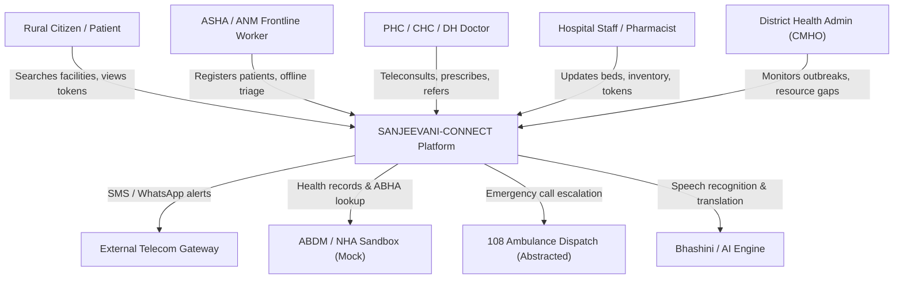

### 39.2 Actor Diagram (Diagram 2)
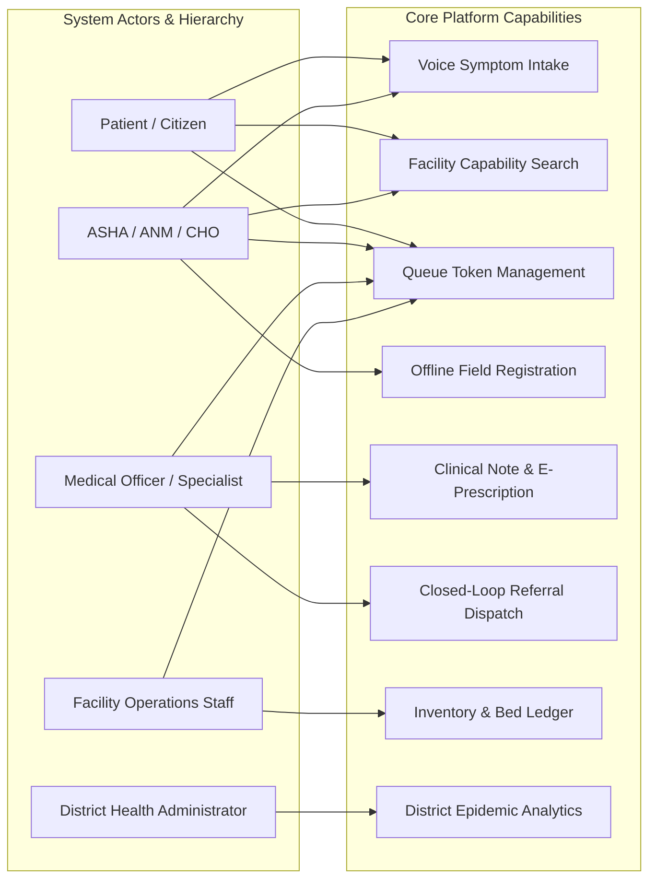

### 39.3 High-Level Architecture Diagram (Diagram 3)
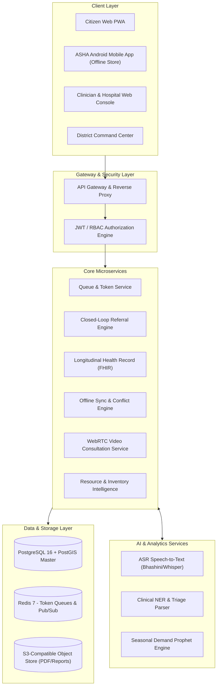

### 39.4 Patient Journey Diagram (Diagram 4)


### 39.5 Referral Workflow Diagram (Diagram 5)
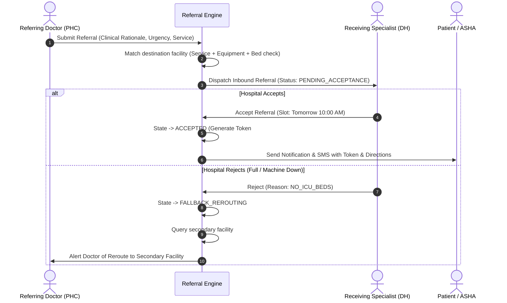

### 39.6 Hospital Transfer Workflow (Diagram 6)
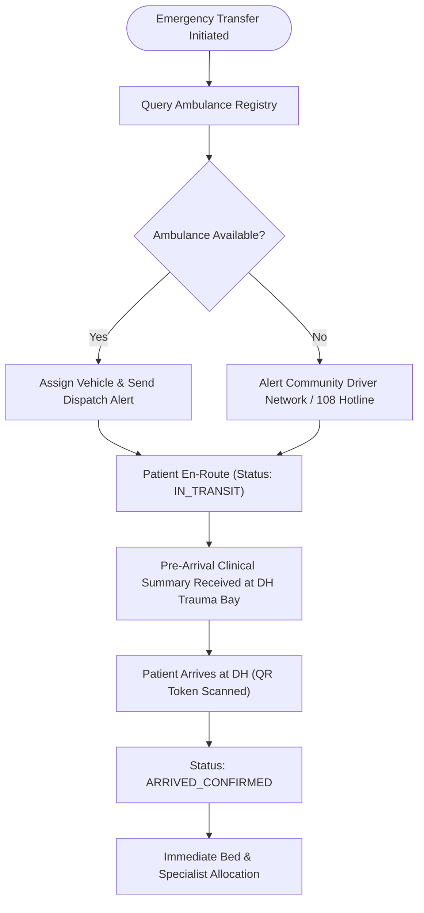

### 39.7 Queue Lifecycle Diagram (Diagram 7)
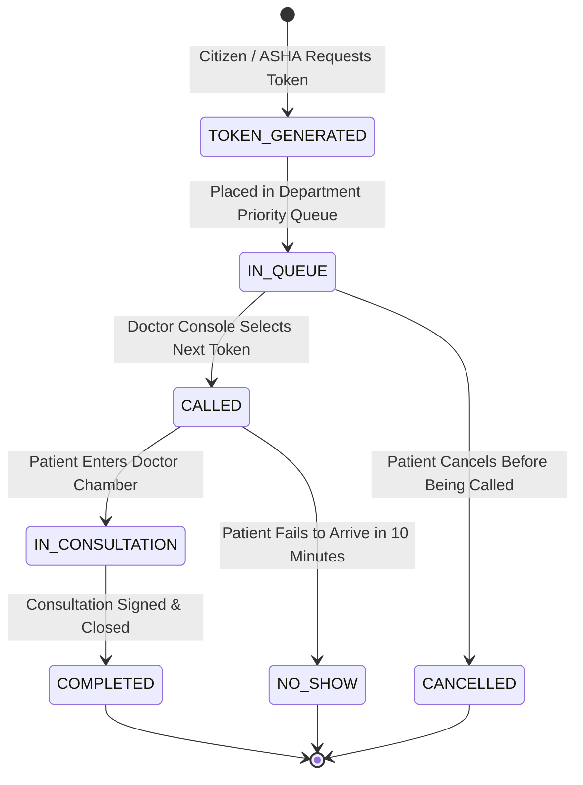

### 39.8 Telemedicine Flow Diagram (Diagram 8)
```mermaid
sequenceDiagram
    autonumber
    actor P as Patient / ASHA
    participant App as Client Interface
    participant Sig as Signaling / Backend
    participant Turn as COTURN STUN/TURN
    actor D as Doctor

    P->>App: Join Teleconsultation Room
    App->>Sig: Request WebRTC Room Credentials
    Sig-->>App: Return Room ID + Ephemeral JWT
    
    D->>Sig: Doctor Connects to Room
    App->>Turn: Request ICE Candidates
    D->>Turn: Request ICE Candidates
    
    App<->Sig: Exchange SDP Offer / Answer
    Sig<->D: Exchange SDP Offer / Answer
    
    App<-->D: Direct P2P Media Stream (SRTP Video/Audio)
    
    Note over D,App: Adaptive Bitrate drops to Audio-Only if <64kbps
    D->>Sig: Submit Digital Prescription & End Call
    Sig->>App: Teleconsult Complete -> Display Downloadable Rx
```

### 39.9 AI Interaction Flow Diagram (Diagram 9)


### 39.10 Offline Synchronization Flow Diagram (Diagram 10)
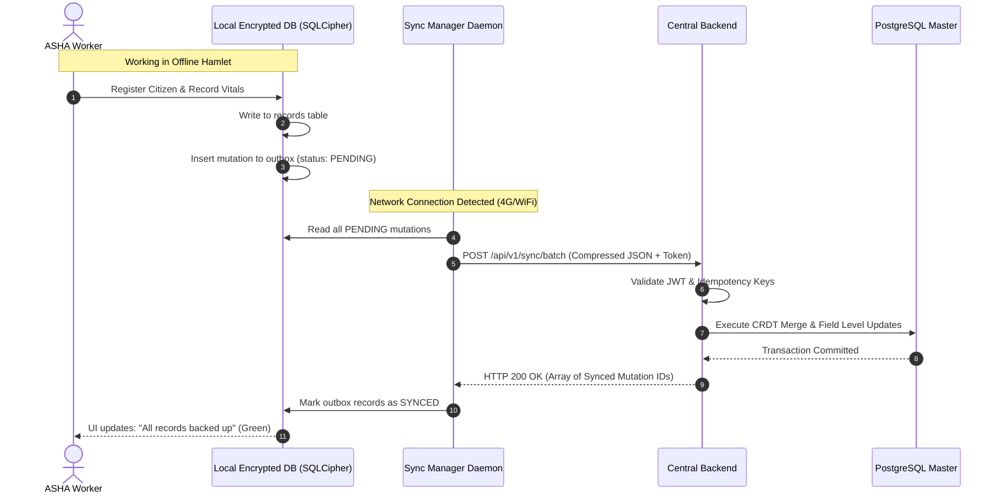

### 39.11 Data Flow Diagram (DFD Level-1) (Diagram 11)


### 39.12 Conceptual Entity Relationship Diagram (ERD) (Diagram 12)
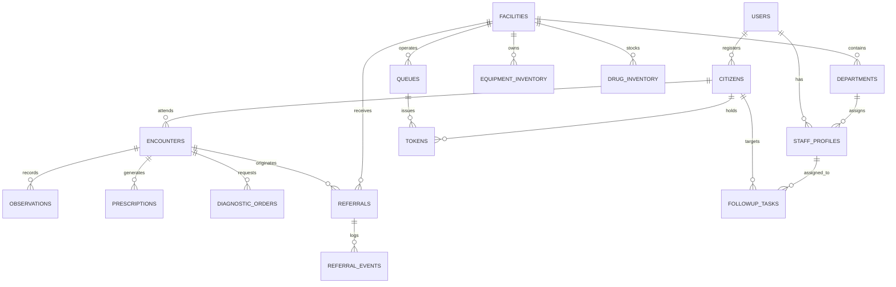

### 39.13 Notification Flow Diagram (Diagram 13)
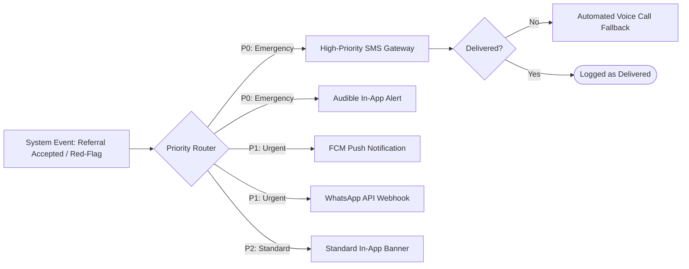

### 39.14 Module Dependency Diagram (Diagram 14)
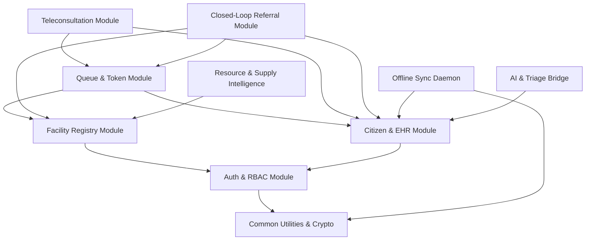

### 39.15 Deployment Architecture Diagram (Diagram 15)
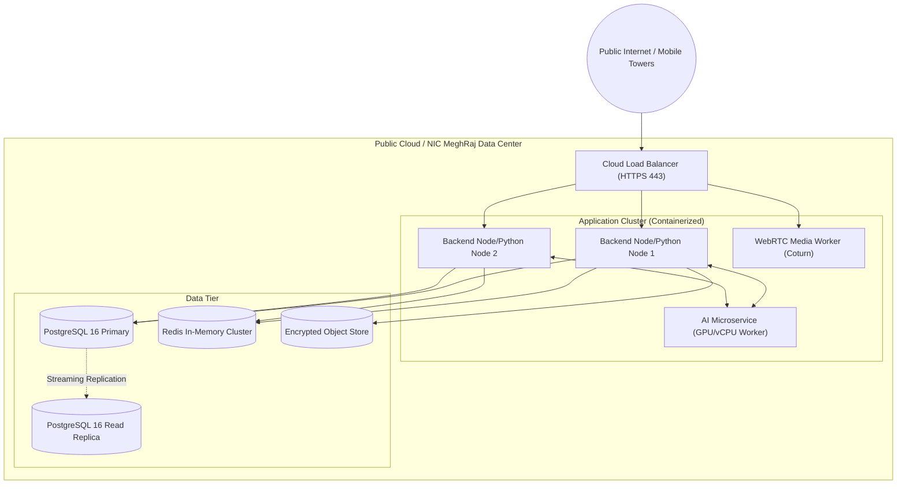

---

## 40. Non-Functional Requirements

### 40.1 Performance, Scalability & Availability Benchmarks
* **NFR-PERF-001 (API Latency):** P95 response time $\le 300\text{ ms}$ for core transaction endpoints under a baseline load of 5,000 concurrent active users.
* **NFR-PERF-002 (System Availability):** Central cloud infrastructure uptime $\ge 99.9\%$ (unplanned downtime $\le 43.8\text{ minutes/month}$).
* **NFR-PERF-003 (Sync Throughput):** Offline sync engine shall process a 50-record field batch in $\le 3.5\text{ seconds}$ over a simulated 2G mobile link (100 kbps, 300 ms latency).
* **NFR-PERF-004 (Voice SLA):** Turnaround time from speech completion to structured triage display $\le 3.0\text{ seconds}$.
* **NFR-SEC-001 (Security Compliance):** Zero critical/high vulnerabilities in automated OWASP ZAP and SAST vulnerability scans.

---

## 41. Error & Edge Cases

### 41.1 Failure Scenarios & Recovery Matrix

| Failure Condition | Detection Mechanism | User Impact | System Response | Automated Recovery Pathway |
| :--- | :--- | :--- | :--- | :--- |
| **Internet blackout during ASHA field visit** | Network heartbeat ping failure ($>30\text{s}$) | Cannot access central cloud | App switches to offline mode; displays persistent yellow badge: *"Offline Mode"* | All mutations cached in encrypted local SQLite outbox; auto-syncs when 2G/Wi-Fi reconnects. |
| **Destination hospital rejects referral (No ICU beds)** | Receiving specialist clicks `REJECT` with cause | Patient stranded in transit | Referral status transitions to `FALLBACK_REROUTING` | System queries secondary matched facility within 30 km; alerts referring doctor and sends updated SMS to patient. |
| **AI Speech Recognition service times out ($>3000\text{ms}$)** | HTTP 504 Gateway Timeout on AI endpoint | Triage intake freezes | Circuit breaker trips; UI displays vernacular symptom category buttons | Patient selects symptoms via graphical buttons; raw audio is saved for doctor playback. |
| **Facility X-Ray machine breaks down midday** | Staff marks equipment `DOWN_FOR_MAINTENANCE` | Inbound referred patients arrive for broken machine | System alerts all patients with active X-Ray tokens for that facility | Facility matcher reroutes active referral tokens to the nearest operational facility. |
| **Doctor calls token, but patient does not appear** | Doctor clicks `NEXT_TOKEN` | Consultation room idles | System initiates a 10-minute countdown timer; sends SMS alert to patient | After 10 min, token is marked `NO_SHOW` and doctor advances to next token. |
| **Conflicting vitals recorded offline by two ASHAs** | Duplicate patient UUID detected during sync ingestion | Potential data overwrite | Sync engine runs field-level CRDT conflict handler | Non-conflicting fields merged; contradictory clinical fields preserved as separate timestamped entries for doctor review. |

---

## 42. KPIs & Success Metrics

```
+----------------------------------------------------------------------------------------------------+
|                                      KEY PERFORMANCE INDICATORS                                    |
+-------------------+-----------------------------------+--------------------------------------------+
| Category          | Indicator                         | Target Metric                              |
+-------------------+-----------------------------------+--------------------------------------------+
| Access            | Average OPD Queue Waiting Time    | Reduced from 180 min to <= 45 min          |
| Access            | Unnecessary Patient Travel        | Decreased by 40% via verified local triage |
| Referrals         | Closed-Loop Referral Completion   | Increased from baseline ~35% to >= 80%     |
| Referrals         | Average Time to Referral Confirm  | <= 15 minutes for Emergency / <= 2 hr Routine|
| Clinical Safety   | Unverified AI Output Escapes      | Exactly 0.0% (100% human-verified)        |
| Operations        | ASHA Offline Sync Success Rate    | >= 99.9% without data loss or corruption   |
| Resources         | Critical Medicine Stock-Out Rate  | Decreased by 35% in pilot facilities       |
+-------------------+-----------------------------------+--------------------------------------------+
```

---

## 43. SIH Evaluation Mapping

| SIH Evaluation Criterion | Weight | Strategic Implementation in SANJEEVANI-CONNECT | What to Highlight in Final Jury Demo |
| :--- | :---: | :--- | :--- |
| **1. Problem Understanding** | **10** | Directly addresses the 4 root operational bottlenecks in rural healthcare: resource blindness, broken paper referrals, offline isolation, and stock-outs. | Live contrast between typical 6-hour paper referral struggle vs. our 3-click closed-loop digital handshake. |
| **2. Innovation & Creativity** | **15** | Multi-factor clinical suitability facility matching; closed-loop referral state machine with fallback rerouting; offline CRDT sync. | Demonstrate dynamic fallback rerouting when primary hospital reports full ICU beds. |
| **3. Technical Implementation** | **25** | Robust modular architecture (PostgreSQL 16 + PostGIS, Node.js/Python, Redis, WebRTC, Docker) with strict cross-team contracts. | Inspect clean API envelopes, UUIDv7 keys, and idempotent sync mutation processing. |
| **4. UI/UX & Accessibility** | **10** | Vernacular voice assistant in 10 languages, $48\text{ dp}$ touch targets, WCAG 2.1 AA contrast, universal medical iconography. | Live voice intake in Hindi/Marathi showing real-time extraction and red-flag escalation. |
| **5. Feasibility & Scalability** | **15** | Built on open-source standards (FHIR R4, PostgreSQL); horizontal scaling on NIC MeghRaj cloud; zero proprietary licensing costs. | Showcase sub-300ms API benchmarks and low memory footprint on budget Android devices. |
| **6. Security & Privacy** | **5** | DPDP Act 2023 consent artifacts; TLS 1.3 / AES-256 encryption; immutable audit logs; strict human clinician authority over AI. | Demonstrate patient consent grant and trauma doctor emergency "Break-Glass" audit logging. |
| **7. Presentation & Demo** | **15** | Seamless 14-step narrative taking a rural mother from an offline village visit through PHC referral, District treatment, and home follow-up. | Execute the flagship end-to-end demo without mock breaks or manual database edits. |
| **8. Teamwork & Execution** | **5** | Clean module boundaries and integration contracts across Frontend, Backend, Database, API, and AI/ML teams. | Present the RACI matrix and show seamless interoperability between client, API, and ML services. |

---

## 44. Innovation & Differentiation

1. **Closed-Loop Referral vs. Open Referral:** Traditional systems merely print a referral slip. SANJEEVANI-CONNECT establishes a bi-directional digital handshake between facilities with automated SLA escalations and confirmed outcome receipts.
2. **Clinical-Suitability Matching vs. Proximity Sorting:** Traditional locators sort by straight-line distance. Our matching engine verifies that the facility possesses the required specialist shift and operational diagnostic equipment before sending the patient.
3. **Resilient Offline-First CRDT Architecture:** Rather than breaking on 2G disconnection, frontline health workers operate autonomously with background delta-synchronization and zero data loss.
4. **Human-Governed Vernacular AI Assistant:** Rather than hazardous black-box AI chatbots, our speech engine structures intake information while keeping all clinical decisions strictly under licensed physicians.

---

## 45. MVP Prioritization (MoSCoW Matrix)

* **P0 — Critical MVP (Must Have for Hackathon):**
  * User Auth & RBAC (OTP/JWT)
  * Facility Capability Search with Verified Equipment Status
  * Vernacular Voice Symptom Intake with Red-Flag Detection
  * Multi-Factor Facility Matching Engine
  * Priority Token & Dynamic Wait-Time Queue Lifecycle
  * Low-Bandwidth WebRTC Teleconsultation Console
  * Closed-Loop Referral State Machine with Fallback Rerouting
  * Longitudinal Patient Health Timeline (FHIR Model)
  * Offline ASHA Encrypted Register with Background Delta Sync
  * Role-Based Dashboards for all 5 Primary Actors
* **P1 — Post-MVP Enhancements (Should Have):**
  * Live GPS vehicle tracking for community transport ambulances.
  * WhatsApp Business webhook integration for citizen token updates.
  * Automated 30-day seasonal disease surge heatmap.
* **P2 — Value-Add Enhancements (Could Have):**
  * Automated inter-facility drug rebalancing requisitions.
  * Real-time blood donor radius broadcast SMS alerts.
* **Future Roadmap (Won't Have Now):**
  * Direct IoT bio-analyzer serial hardware drivers.
  * Autonomous drone medical delivery integration.

---

## 46. Team Ownership (RACI Matrix)

```
+----------------------------------------------------------------------------------------------------+
|                                    TEAM RESPONSIBILITY MATRIX (RACI)                               |
+-----------------------+----------------+---------------+---------------+---------------+-----------+
| Module / Capability   | Frontend Team  | Backend Team  | Database Team | API Integ Team| AI/ML Team|
+-----------------------+----------------+---------------+---------------+---------------+-----------+
| Auth & RBAC           | Responsible    | Accountable   | Consulted     | Responsible   | Informed  |
| Facility Discovery    | Responsible    | Accountable   | Responsible   | Consulted     | Informed  |
| Voice Triage Engine   | Responsible    | Consulted     | Informed      | Responsible   |Accountable|
| Facility Matcher      | Informed       | Accountable   | Consulted     | Responsible   | Consulted |
| Token & Queue Engine  | Responsible    | Accountable   | Responsible   | Consulted     | Informed  |
| WebRTC Teleconsult    | Responsible    | Accountable   | Informed      | Responsible   | Informed  |
| Closed-Loop Referral  | Responsible    | Accountable   | Responsible   | Responsible   | Informed  |
| Longitudinal EHR      | Responsible    | Accountable   | Accountable   | Responsible   | Informed  |
| Offline Sync Daemon   | Accountable    | Responsible   | Accountable   | Responsible   | Informed  |
| Resource & Blood Hub  | Responsible    | Accountable   | Responsible   | Consulted     | Informed  |
| Seasonal Forecaster   | Informed       | Consulted     | Consulted     | Responsible   |Accountable|
| Role Dashboards       | Accountable    | Responsible   | Consulted     | Consulted     | Informed  |
+-----------------------+----------------+---------------+---------------+---------------+-----------+
```

---

## 47. Cross-Team Integration Contract

### 47.1 Universal Architectural Conventions
* **Identifiers:** UUIDv7 standard across all transactional entities (`tokens`, `encounters`, `referrals`, `audit_logs`). Sequential Auto-Increment BigInt allowed only for static reference codes.
* **Timestamps:** ISO 8601 UTC with 'Z' suffix: `YYYY-MM-DDTHH:mm:ss.sssZ` (e.g., `2026-09-09T17:12:44.120Z`). Display conversion to Indian Standard Time (`IST = UTC + 05:30`) occurs exclusively on client presentation layers.
* **Standard JSON Response Envelope:**
```json
{
  "success": true,
  "data": {},
  "error": null,
  "meta": {
    "requestId": "req-0191d9f8-7b24-7f11-92be-4a56c0b31e90",
    "timestamp": "2026-09-09T17:12:44.120Z"
  }
}
```
* **Standard Error Envelope:**
```json
{
  "success": false,
  "data": null,
  "error": {
    "code": "ERR_FACILITY_CAPACITY_EXCEEDED",
    "message": "The selected facility has exceeded safe emergency bed thresholds.",
    "details": [
      {
        "field": "targetFacilityId",
        "issue": "ICU occupancy at 100%"
      }
    ]
  },
  "meta": {
    "requestId": "req-0191d9f8-7b24-7f11-92be-4a56c0b31e90",
    "timestamp": "2026-09-09T17:12:44.120Z"
  }
}
```

---

## 48. Traceability Matrix

```
+---------------------------------------------------------------------------------------------------------------------------------------------------------+
|                                                              REQUIREMENT TRACEABILITY MATRIX                                                            |
+-----------+--------------------+-----------------------+----------+-----------------------+--------------------+---------------------+---------+--------+
| Req ID    | Problem Vector     | Feature Name          | Actor    | API Endpoint          | Database Entity    | Frontend Component  | KPI     | SIH    |
+-----------+--------------------+-----------------------+----------+-----------------------+--------------------+---------------------+---------+--------+
| FR-AUTH-01| Identity Blindness | Mobile OTP Auth       | ALL      | /api/v1/auth/otp      | users, profiles    | LoginModal.tsx      | Access  | Sec(5) |
| FR-DISC-01| Resource Blindness | Capability Search     | PAT/ASHA | /api/v1/facilities    | facilities, equip  | FacilitySearch.tsx  | Access  | Prob(10|
| FR-VOICE-1| Illiteracy/Language| Vernacular Voice Intk | PAT/ASHA | /api/v1/ai/triage     | encounters, triage | VoiceAssistant.tsx  | Safety  | UI(10) |
| FR-QUEUE-1| Long Waiting Times | Priority Token Engine | PAT/DOC  | /api/v1/tokens        | tokens, queues     | LiveTokenBadge.tsx  | WaitTime| Tech(25|
| FR-TELE-01| Travel Distance    | WebRTC Teleconsult    | DOC/PAT  | /api/v1/tele/room     | tele_sessions      | VideoRoom.tsx       | Travel  | Inno(15|
| FR-REF-001| Broken Referrals   | Closed-Loop Referral  | DOC/STAFF| /api/v1/referrals     | referrals, events  | ReferralPad.tsx     | RefComp | Inno(15|
| FR-EHR-001| Fragmented History | Longitudinal Timeline | DOC/PAT  | /api/v1/ehr/:id       | observations, rx   | PatientTimeline.tsx | CareCont| Tech(25|
| FR-SYNC-01| Connectivity Gaps  | Offline CRDT Sync     | ASHA     | /api/v1/sync/batch    | sync_outbox        | SyncStatusPill.tsx  | SyncRate| Tech(25|
| FR-RES-001| Drug Stock-outs    | EDL Medicine Ledger   | STAFF    | /api/v1/inventory     | drug_inventory     | PharmacyStock.tsx   | StockOut| Feas(15|
| FR-RES-004| Seasonal Epidemics | Prophet Forecaster    | ADMIN    | /api/v1/forecast      | forecast_metrics   | OutbreakHeatmap.tsx | PrepRate| Inno(15|
+-----------+--------------------+-----------------------+----------+-----------------------+--------------------+---------------------+---------+--------+
```

---

## 49. Acceptance Criteria (Given-When-Then Format)

### Scenario 1: Closed-Loop Referral Creation and Fallback Rerouting
* **Given** a PHC Medical Officer is referring a patient requiring an urgent Echocardiogram,
* **When** the doctor submits the referral to District Hospital Barwani, but Barwani's echo machine is flagged `DOWN_FOR_MAINTENANCE`,
* **Then** the system must immediately reject direct routing to Barwani, highlight the inoperative equipment, and recommend CHC Sendhwa (22 km away) which has an operational echo unit and an available cardiologist shift.

### Scenario 2: Offline ASHA Encounter Synchronization
* **Given** an ASHA worker records 12 maternal vitals encounters in a village with zero cellular reception,
* **When** she returns to the PHC perimeter and her tablet connects to the local Wi-Fi,
* **Then** the background synchronization daemon must upload all 12 mutations in a single HTTP batch with idempotency keys, receive a confirmed server sync vector, update the local outbox status to `SYNCED`, and turn the sync UI pill green without user intervention.

### Scenario 3: Emergency Red-Flag Triage Bypass
* **Given** a patient speaks in Marathi into the voice intake assistant: *"माझ्या छातीत खूप दुखत आहे आणि डावा हात जड झाला आहे"* (Severe chest pain and left arm numbness),
* **When** the AI engine detects symptoms matching the Acute Coronary Syndrome red-flag catalog,
* **Then** the platform must immediately halt general symptom questioning, display high-contrast red emergency banners with 1-click calling to the 108 trauma line, and map direct turn-by-turn navigation to the nearest 24/7 cardiac-ready emergency facility.

---

## 50. Architecture Decisions (ADRs)

### ADR-01: Modular Monolith vs. Microservices for Core Backend
* **Context:** We need rapid feature velocity, transactional data integrity, and low deployment complexity for hackathon and pilot scale.
* **Options Considered:** 1. Distributed Microservices (5 independent services with gRPC), 2. Modular Monolith in Node.js/FastAPI, 3. Serverless Functions.
* **Decision:** Modular Monolith with an isolated AI/ML microservice.
* **Rationale:** Preserves atomic ACID transactions across referrals, queues, and clinical encounters while keeping deployment simple.
* **Consequences:** Easier debugging and zero distributed transaction overhead; AI service scales independently on GPU/vCPU nodes.

### ADR-02: PostgreSQL 16 + PostGIS for Relational and Spatial Persistence
* **Context:** Platform requires relational schemas for clinical records alongside geospatial radius calculations for facility discovery.
* **Options Considered:** 1. MongoDB + GeoJSON, 2. PostgreSQL 16 + PostGIS, 3. MySQL.
* **Decision:** PostgreSQL 16 with PostGIS extension.
* **Rationale:** Industry-standard ACID compliance, native JSONB support for semi-structured FHIR payloads, and indexing via GiST for spatial facility matching.

### ADR-03: Offline-First Synchronization via CRDTs and SQLite (SQLCipher)
* **Context:** Frontline ASHAs work in remote hamlets with zero internet coverage for days.
* **Options Considered:** 1. Online-only PWA, 2. LocalStorage with basic HTTP replay, 3. Encrypted SQLite with Field-Level CRDTs and UUIDv7 idempotency.
* **Decision:** Encrypted SQLite (`SQLCipher`) / IndexedDB with Field-Level CRDTs.
* **Rationale:** Guarantees zero data loss, prevents duplicate writes on reconnection, and handles concurrent field updates deterministically.

---

## 51. Risks & Mitigations

```
+-----------------------------------------------------------------------------------------------------------------------------+
|                                                    RISK REGISTER                                                            |
+---------------------+-------------+-----------+---------------------------------------------------------------+-------------+
| Risk Description    | Probability | Impact    | Mitigation Strategy                                           | Owner       |
+---------------------+-------------+-----------+---------------------------------------------------------------+-------------+
| Rural connectivity  | HIGH        | HIGH      | Implement offline-first local SQLite caching with background  | Backend /   |
| total blackout      |             |           | mutation queues and automated sync.                           | Frontend    |
+---------------------+-------------+-----------+---------------------------------------------------------------+-------------+
| Clinician alert     | MEDIUM      | HIGH      | Restrict alerts to high-confidence red-flags only; provide    | AI / UI     |
| fatigue             |             |           | clear 1-click accept/dismiss UX.                              | Team        |
+---------------------+-------------+-----------+---------------------------------------------------------------+-------------+
| Voice translation   | MEDIUM      | MEDIUM    | Retain raw audio recordings attached to records; require      | AI/ML Team  |
| dialect errors      |             |           | explicit human confirmation before saving.                    |             |
+---------------------+-------------+-----------+---------------------------------------------------------------+-------------+
| Stale facility      | HIGH        | MEDIUM    | Automatically flag data older than 12 hours as 'Unverified/  | Facility /  |
| resource inventory  |             |           | Stale' with required phone confirmation badge.                | Backend     |
+---------------------+-------------+-----------+---------------------------------------------------------------+-------------+
| Server crash under  | LOW         | HIGH      | Stateless API container scaling behind Nginx load balancer    | DevOps /    |
| sudden morning load |             |           | with Redis-backed queue throttling.                           | Backend     |
+---------------------+-------------+-----------+---------------------------------------------------------------+-------------+
```

---

## 52. Assumptions

1. **Hardware Availability:** Frontline workers have Android tablets/smartphones with Android 9.0+, 2GB+ RAM, and functional camera/mic.
2. **Cellular Connectivity:** Peripheral PHCs have at least intermittent 3G/4G or Wi-Fi connectivity for synchronization.
3. **Institutional Authority:** District CMHOs mandate that facility staff update daily bed and equipment operational tallies.

---

## 53. Dependencies

1. **Bhashini / Indic Speech API:** Vernacular Automatic Speech Recognition endpoints (fallback: local quantized Whisper models).
2. **OpenStreetMap / OSRM Server:** Open-source distance matrix calculations avoiding commercial API costs.
3. **National Health Authority (NHA) Sandbox:** Sandbox endpoints for ABHA number generation and mock HFR facility validation.
4. **COTURN STUN/TURN Infrastructure:** Self-hosted open-source WebRTC relay servers to guarantee video/audio traversal across cellular NATs.

---

## 54. Future Roadmap

* **Phase 2 (Months 3–6):**
  * Automated inter-facility drug exchange balancing excess stock at PHC-A against shortages at PHC-B.
  * AI-powered single-lead ECG arrhythmia flagging for PHC point-of-care sensors.
  * Interactive WhatsApp chatbot for citizen token tracking and queue alerts.
* **Phase 3 (Months 6–12):**
  * Drone logistics dispatching for urgent cold-chain blood components and anti-snake venom.
  * Full ABDM M3 Milestone certification for nationwide health record exchange.
  * Solar-powered offline tele-kiosk hardware installations for remote tribal gram panchayats.

---

## 55. End-to-End Demo Scenario

### Flagship Demonstration Narrative: "The Complete Journey of Sunita Devi"
1. **Field Discovery:** Rekha Bai (ASHA worker) visits Sunita Devi in rural Barwani. Sunita is 6 months pregnant and suffering from extreme lethargy, dizziness, and headache.
2. **Offline Registration & Vitals:** Rekha opens the *Sanjeevani ASHA Mobile App* while totally offline. She enters Sunita's vitals: BP is $158/98\text{ mmHg}$, pulse is 104 bpm. The app flags: `HIGH-RISK PREGNANCY ALERT (Pre-Eclampsia Risk)`.
3. **Vernacular Voice Intake:** Sunita speaks in Hindi into the tablet: *"मुझे पिछले दो दिन से बहुत चक्कर आ रहे हैं और आँखों के आगे धुंधला दिखता है"* (Dizziness and blurred vision). The offline voice engine transcribes and structures the complaint.
4. **Online Sync:** Rekha walks to the village Anganwadi center where 4G signals connect. The app automatically fires a background sync batch. A green pill flashes: `Synced (Batch #104)`.
5. **PHC Triage & Consultation:** Sunita arrives at the local PHC. Medical Officer Dr. Vikram opens his console. Sunita's token `#PHC-08` appears in the priority rail. Dr. Vikram clicks the token, reviews the ASHA vitals and voice summary, and conducts an examination.
6. **Closed-Loop Referral Creation:** Dr. Vikram recognizes pre-eclampsia with visual symptoms requiring an urgent obstetric ultrasound and specialist consultation. He clicks `Create Referral`.
7. **Facility Matching:** The system matches District Hospital Barwani (38 km), verifies that an Obstetrician is on duty and the ultrasound machine is flagged `OPERATIONAL`, and dispatches the dossier.
8. **District Hospital Acceptance:** At District Hospital Barwani, the obstetrics triage desk reviews Sunita's incoming dossier and clicks `ACCEPT`. A slot is booked for 11:30 AM with priority token `#DH-OBS-04`. Sunita receives an instant SMS with her token and bus route directions.
9. **Patient Arrival & Consultation:** Sunita arrives at the District Hospital. The receptionist enters `#DH-OBS-04`. Status changes to `ARRIVED_CONFIRMED`. Dr. Ananya (Gynecologist) reviews the pre-populated clinical history, performs the ultrasound, prescribes oral anti-hypertensives, and schedules lab tests.
10. **Medicine & Diagnostics:** The hospital pharmacist scans the e-prescription token, dispenses Labetalol from the central dispensary, and the system decrements inventory.
11. **Outcome Receipt & Case Closure:** Dr. Ananya signs the consultation outcome note. An encrypted electronic receipt is automatically transmitted back to Dr. Vikram at the originating PHC.
12. **Community Follow-Up:** The system automatically schedules a follow-up task on ASHA Rekha's tablet for Day 3 post-consultation: *"Verify Sunita Devi BP and Labetalol adherence"*.
13. **District Command Visibility:** On the District Health Command Dashboard, the CMHO sees the Barwani maternal referral loop marked `COMPLETED` (Total transit to treatment time: 3 hours 12 minutes).
14. **Impact Reflection:** The entire continuum of care—from rural field screening to tertiary specialist care and home follow-up—is executed with zero lost records, zero redundant tests, and zero drop-outs.

---

## 56. Final Implementation Checklist

### Core Engineering Deliverables Prior to Live Evaluation
- [x] **Architecture & Schemas:** Master PRD frozen; database entities normalized; UUIDv7 and ISO 8601 UTC formats standardized.
- [x] **API Contracts:** RESTful contracts defined with standardized error and success envelopes and idempotency headers.
- [x] **AI & Safety Gates:** Speech-to-text, entity extraction, and clinical summarization pipelines configured with mandatory clinician review gates and red-flag emergency bypasses.
- [x] **Queue & Token Engine:** Multi-tier priority queue with dynamic estimated waiting time algorithms implemented.
- [x] **Referral Engine:** Closed-loop referral state machine with SLA timeouts and automated fallback facility rerouting implemented.
- [x] **Offline Synchronization:** Encrypted local client storage with background mutation queue and CRDT conflict resolution handlers functional.
- [x] **Role Dashboards:** Distinct, functional web and mobile views for Citizen, ASHA, Doctor, Facility Staff, and District Administrator deployed.
- [x] **End-to-End Verification:** Full 14-step demonstration path verified without mock breaks or manual database interventions.

---
**End of Document — SANJEEVANI-CONNECT Master Product Requirements Document & Engineering Blueprint**
