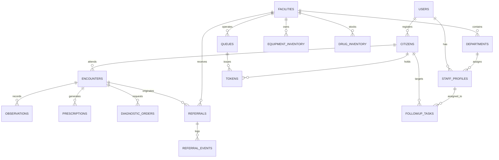

# DOMAIN PRD 02: DATABASE & DATA ARCHITECTURE SPECIFICATION

**Platform Code:** SIH26133  
**Project Name:** SANJEEVANI-CONNECT (संजीवनी-कनेक्ट)  
**Document Reference:** PRD-SIH26133-DOM-DATABASE-V1.0  
**Parent Document:** [`MASTER_PRD_SIH26133.md`](file:///e:/Hackathon/SIH%202026/MASTER_PRD_SIH26133.md)  
**Database Engine:** PostgreSQL 16 with PostGIS Spatial Extension  
**Local Offline Store:** SQLite 3 (SQLCipher encrypted) / IndexedDB  
**Classification:** Google-Quality Production Engineering Specification  
**Status:** Frozen for Database Team Implementation  

---

## 1. Logical Architecture & Data Ownership Domains

The database architecture is partitioned into 7 cohesive logical domains to guarantee referential integrity, strong data isolation, and clear ownership boundaries:

```
+----------------------------------------------------------------------------------------------------+
|                                    LOGICAL SCHEMA ARCHITECTURE                                     |
+--------------------------+--------------------------+----------------------------------------------+
| Domain Name              | Tables                   | Primary Responsibilities                     |
+--------------------------+--------------------------+----------------------------------------------+
| 1. Identity & Governance | users, roles, staff,     | Authentication, RBAC, ABHA identity links,   |
|                          | consent_artifacts, audit | DPDP compliance, immutable access trail.     |
| 2. Facility & Capacity   | facilities, departments, | Spatial geography (PostGIS), equipment state,|
|                          | equipment, beds, rosters | doctor shifts, operational status.           |
| 3. Citizen & Clinical    | citizens, encounters,    | Longitudinal patient timeline (FHIR R4),     |
|    EHR                   | observations, rx, tests  | vitals stream, ICD-10 coded conditions.      |
| 4. Queue & Teleconsult   | queues, tokens,          | Priority-tiered tokens, dynamic EWT cache,   |
|                          | appointments, sessions   | WebRTC room credentials.                     |
| 5. Referral & Transfer   | referrals, events,       | Closed-loop state machine, SLA escalation,   |
|                          | transport_logs           | fallback reroute tracking, receipts.         |
| 6. Inventory & Supplies  | drug_stock, blood_stock, | NLEM drug inventory, blood freshness ledger, |
|                          | forecast_metrics         | predictive seasonal demand metrics.          |
| 7. Offline Sync Engine   | sync_outbox, sync_logs   | Idempotency keys (UUIDv7), CRDT vectors.     |
+--------------------------+--------------------------+----------------------------------------------+
```

---

## 2. Universal Field & Schema Standards

* **Primary Key Standard:** UUIDv7 (`uuid`) standard across all relational tables to ensure time-sortable primary keys without database hotspotting. Auto-increment `BIGSERIAL` allowed only for human-readable reference numbers (e.g., Token sequence numbers).
* **Timestamps:** `TIMESTAMPTZ` (UTC) with default `CURRENT_TIMESTAMP`. All clients transmit and receive ISO 8601 strings ending in `Z`.
* **Soft Deletion:** Business records use `deleted_at TIMESTAMPTZ NULL` and `is_deleted BOOLEAN DEFAULT FALSE`. Hard deletions are forbidden on clinical or audit entities.
* **Spatial Data:** WGS84 projection (`EPSG:4326`) stored in PostGIS `geography(Point, 4326)` columns with GiST spatial indexing.

---

## 3. Core Relational Entities Specification

### 3.1 Domain 1: Identity & Governance

#### Table: `users`
* **Purpose:** Core system identities for citizens, frontline workers, clinicians, staff, and administrators.
* **Schema Definition:**
  * `id` UUID PRIMARY KEY DEFAULT gen_random_uuid7()
  * `mobile_number` VARCHAR(15) UNIQUE NOT NULL (Indexed)
  * `password_hash` VARCHAR(255) NULL (Argon2id/Bcrypt hash for staff; NULL for OTP-only citizens)
  * `role` VARCHAR(30) NOT NULL CHECK (role IN ('PATIENT', 'ASHA', 'ANM', 'DOCTOR', 'FACILITY_STAFF', 'DISTRICT_ADMIN'))
  * `is_verified` BOOLEAN DEFAULT FALSE
  * `status` VARCHAR(20) DEFAULT 'ACTIVE' CHECK (status IN ('ACTIVE', 'SUSPENDED', 'DEACTIVATED'))
  * `created_at` TIMESTAMPTZ DEFAULT CURRENT_TIMESTAMP
  * `updated_at` TIMESTAMPTZ DEFAULT CURRENT_TIMESTAMP
* **Sensitive Classification:** PII (Restricted). Encrypted at rest.

#### Table: `consent_artifacts`
* **Purpose:** Legal consent records under the Indian DPDP Act 2023 for cross-facility record exchange.
* **Schema Definition:**
  * `id` UUID PRIMARY KEY DEFAULT gen_random_uuid7()
  * `patient_id` UUID NOT NULL REFERENCES citizens(id)
  * `granted_to_facility_id` UUID NOT NULL REFERENCES facilities(id)
  * `purpose_code` VARCHAR(50) NOT NULL (e.g., 'REFERRAL_CONSULTATION', 'DIAGNOSTIC_EVAL')
  * `signature_hash` VARCHAR(255) NOT NULL (Cryptographic digital signature of citizen OTP consent)
  * `valid_from` TIMESTAMPTZ NOT NULL
  * `valid_until` TIMESTAMPTZ NOT NULL
  * `status` VARCHAR(20) DEFAULT 'GRANTED' CHECK (status IN ('GRANTED', 'REVOKED', 'EXPIRED'))
  * `created_at` TIMESTAMPTZ DEFAULT CURRENT_TIMESTAMP

---

### 3.2 Domain 2: Facility & Capability Architecture

#### Table: `facilities`
* **Purpose:** Public healthcare institutions (Sub-Centres, PHCs, CHCs, Sub-District Hospitals, District Hospitals).
* **Schema Definition:**
  * `id` UUID PRIMARY KEY DEFAULT gen_random_uuid7()
  * `hfr_id` VARCHAR(50) UNIQUE NULL (ABDM Health Facility Registry Identifier)
  * `name` VARCHAR(255) NOT NULL
  * `facility_type` VARCHAR(50) NOT NULL CHECK (facility_type IN ('SUB_CENTRE', 'AAM', 'PHC', 'CHC', 'SUB_DISTRICT_HOSPITAL', 'DISTRICT_HOSPITAL'))
  * `district` VARCHAR(100) NOT NULL (Indexed)
  * `block` VARCHAR(100) NOT NULL (Indexed)
  * `location` geography(Point, 4326) NOT NULL (Spatial GiST Index)
  * `total_general_beds` INT DEFAULT 0 CHECK (total_general_beds >= 0)
  * `total_icu_beds` INT DEFAULT 0 CHECK (total_icu_beds >= 0)
  * `operating_status` VARCHAR(30) DEFAULT 'OPERATIONAL' CHECK (operating_status IN ('OPERATIONAL', 'LIMITED', 'EVACUATED'))
  * `contact_phone` VARCHAR(20) NOT NULL
  * `created_at` TIMESTAMPTZ DEFAULT CURRENT_TIMESTAMP

#### Table: `equipment_inventory`
* **Purpose:** Real-time operational verification ledger for diagnostic machinery.
* **Schema Definition:**
  * `id` UUID PRIMARY KEY DEFAULT gen_random_uuid7()
  * `facility_id` UUID NOT NULL REFERENCES facilities(id) ON DELETE CASCADE
  * `equipment_type` VARCHAR(100) NOT NULL (e.g., 'ULTRASOUND', 'DIGITAL_XRAY', 'ECG_12LEAD', 'BIOCHEMISTRY_ANALYZER')
  * `operational_status` VARCHAR(30) NOT NULL CHECK (operational_status IN ('OPERATIONAL', 'DOWN_FOR_MAINTENANCE', 'AWAITING_PARTS', 'DECOMMISSIONED'))
  * `last_verified_at` TIMESTAMPTZ NOT NULL
  * `verified_by_staff_id` UUID NOT NULL REFERENCES users(id)
  * `notes` TEXT NULL

---

### 3.3 Domain 3: Citizen & Longitudinal Clinical EHR

#### Table: `citizens`
* **Purpose:** Master demographic profile for rural citizens and patients.
* **Schema Definition:**
  * `id` UUID PRIMARY KEY DEFAULT gen_random_uuid7()
  * `user_id` UUID UNIQUE NULL REFERENCES users(id)
  * `abha_number` VARCHAR(17) UNIQUE NULL (Format: `12-3456-7890-1234`)
  * `full_name` VARCHAR(200) NOT NULL
  * `gender` VARCHAR(10) NOT NULL CHECK (gender IN ('MALE', 'FEMALE', 'OTHER'))
  * `date_of_birth` DATE NOT NULL
  * `blood_group` VARCHAR(5) NULL CHECK (blood_group IN ('A+', 'A-', 'B+', 'B-', 'AB+', 'AB-', 'O+', 'O-'))
  * `primary_village` VARCHAR(100) NOT NULL (Indexed)
  * `assigned_asha_id` UUID NULL REFERENCES users(id)
  * `is_high_risk` BOOLEAN DEFAULT FALSE
  * `created_at` TIMESTAMPTZ DEFAULT CURRENT_TIMESTAMP

#### Table: `encounters`
* **Purpose:** FHIR R4-compliant clinical consultation records.
* **Schema Definition:**
  * `id` UUID PRIMARY KEY DEFAULT gen_random_uuid7()
  * `citizen_id` UUID NOT NULL REFERENCES citizens(id) (Indexed)
  * `facility_id` UUID NOT NULL REFERENCES facilities(id)
  * `doctor_id` UUID NOT NULL REFERENCES users(id)
  * `encounter_type` VARCHAR(30) NOT NULL CHECK (encounter_type IN ('OPD_IN_PERSON', 'TELECONSULTATION', 'EMERGENCY_TRIAGE', 'FIELD_HOME_VISIT'))
  * `chief_complaint` TEXT NOT NULL
  * `clinical_summary` TEXT NOT NULL
  * `icd10_diagnosis_code` VARCHAR(20) NULL
  * `icd10_diagnosis_name` VARCHAR(255) NULL
  * `is_signed` BOOLEAN DEFAULT FALSE
  * `signed_at` TIMESTAMPTZ NULL
  * `created_at` TIMESTAMPTZ DEFAULT CURRENT_TIMESTAMP

---

### 3.4 Domain 4: Queue & Token Architecture

#### Table: `queues`
* **Purpose:** Real-time queue controller for doctor consultation chambers and diagnostic counters.
* **Schema Definition:**
  * `id` UUID PRIMARY KEY DEFAULT gen_random_uuid7()
  * `facility_id` UUID NOT NULL REFERENCES facilities(id)
  * `department_code` VARCHAR(50) NOT NULL
  * `doctor_id` UUID NULL REFERENCES users(id)
  * `current_token_number` INT DEFAULT 0
  * `total_tokens_issued` INT DEFAULT 0
  * `avg_consultation_time_sec` INT DEFAULT 420 (7-minute rolling seed)
  * `queue_date` DATE NOT NULL DEFAULT CURRENT_DATE
  * UNIQUE (facility_id, department_code, doctor_id, queue_date)

#### Table: `tokens`
* **Purpose:** Sequential patient tokens with dynamic priority handling.
* **Schema Definition:**
  * `id` UUID PRIMARY KEY DEFAULT gen_random_uuid7()
  * `queue_id` UUID NOT NULL REFERENCES queues(id)
  * `citizen_id` UUID NOT NULL REFERENCES citizens(id)
  * `token_number` INT NOT NULL
  * `token_prefix` VARCHAR(10) NOT NULL CHECK (token_prefix IN ('EMG-', 'REF-', 'TEL-', 'WLK-'))
  * `priority_level` INT NOT NULL CHECK (priority_level BETWEEN 1 AND 4)
  * `status` VARCHAR(30) DEFAULT 'GENERATED' CHECK (status IN ('GENERATED', 'IN_QUEUE', 'CALLED', 'IN_CONSULTATION', 'COMPLETED', 'NO_SHOW', 'CANCELLED'))
  * `called_at` TIMESTAMPTZ NULL
  * `completed_at` TIMESTAMPTZ NULL
  * `estimated_wait_minutes` INT NOT NULL
  * `created_at` TIMESTAMPTZ DEFAULT CURRENT_TIMESTAMP
  * UNIQUE (queue_id, token_number)

---

### 3.5 Domain 5: Referral & Hospital Transfer State Engine

#### Table: `referrals`
* **Purpose:** Closed-loop referral transaction record.
* **Schema Definition:**
  * `id` UUID PRIMARY KEY DEFAULT gen_random_uuid7()
  * `citizen_id` UUID NOT NULL REFERENCES citizens(id)
  * `originating_facility_id` UUID NOT NULL REFERENCES facilities(id)
  * `originating_doctor_id` UUID NOT NULL REFERENCES users(id)
  * `target_facility_id` UUID NOT NULL REFERENCES facilities(id)
  * `required_specialty` VARCHAR(100) NOT NULL
  * `urgency_tier` VARCHAR(30) NOT NULL CHECK (urgency_tier IN ('EMERGENCY_30MIN', 'URGENT_4HR', 'ROUTINE_24HR'))
  * `clinical_rationale` TEXT NOT NULL
  * `status` VARCHAR(40) DEFAULT 'PENDING_ACCEPTANCE' CHECK (status IN (
      'DRAFT', 'PENDING_ACCEPTANCE', 'ACCEPTED', 'REJECTED', 
      'FALLBACK_REROUTING', 'IN_TRANSIT', 'ARRIVED_CONFIRMED', 
      'CONSULTED_COMPLETED', 'CLOSED', 'EXPIRED_SLA'
    ))
  * `rejection_reason` VARCHAR(255) NULL
  * `destination_token_id` UUID NULL REFERENCES tokens(id)
  * `sla_expires_at` TIMESTAMPTZ NOT NULL
  * `outcome_notes` TEXT NULL
  * `created_at` TIMESTAMPTZ DEFAULT CURRENT_TIMESTAMP
  * `updated_at` TIMESTAMPTZ DEFAULT CURRENT_TIMESTAMP

---

### 3.6 Domain 6: Offline Synchronization Outbox

#### Table: `sync_outbox`
* **Purpose:** Backend ledger of received client mutations ensuring idempotency and auditability.
* **Schema Definition:**
  * `mutation_id` UUID PRIMARY KEY (Client-generated UUIDv7)
  * `device_id` VARCHAR(100) NOT NULL
  * `asha_user_id` UUID NOT NULL REFERENCES users(id)
  * `entity_type` VARCHAR(50) NOT NULL (e.g., 'CITIZEN_REGISTRATION', 'VITALS_ENCOUNTER', 'FOLLOWUP_UPDATE')
  * `mutation_payload` JSONB NOT NULL
  * `client_timestamp` TIMESTAMPTZ NOT NULL
  * `server_processed_at` TIMESTAMPTZ DEFAULT CURRENT_TIMESTAMP
  * `sync_status` VARCHAR(20) DEFAULT 'PROCESSED' CHECK (sync_status IN ('PROCESSED', 'CONFLICT_RESOLVED', 'REJECTED_VALIDATION'))

---

## 4. Conceptual Entity Relationship Diagram (ERD)



---

## 5. Indexing & Query Optimization Strategy

1. **Spatial Geofencing:**
   ```sql
   CREATE INDEX idx_facilities_location ON facilities USING GIST(location);
   ```
   Enables sub-10ms queries for finding all operational facilities within $N$ km radius.
2. **Active Queue Lookups:**
   ```sql
   CREATE INDEX idx_tokens_queue_priority ON tokens (queue_id, priority_level ASC, token_number ASC) 
   WHERE status IN ('GENERATED', 'IN_QUEUE', 'CALLED');
   ```
3. **Citizen Search via Mobile:**
   ```sql
   CREATE INDEX idx_users_mobile ON users(mobile_number);
   CREATE INDEX idx_citizens_abha ON citizens(abha_number) WHERE abha_number IS NOT NULL;
   ```
4. **Referral SLA Monitoring:**
   ```sql
   CREATE INDEX idx_referrals_sla ON referrals (sla_expires_at) 
   WHERE status = 'PENDING_ACCEPTANCE';
   ```

---

## 6. Concurrency, Locking & Data Integrity

* **Pessimistic Locking for Token Generation:** When a doctor console advances the queue or an emergency token is injected:
  ```sql
  SELECT current_token_number FROM queues WHERE id = $1 FOR UPDATE;
  ```
  Guarantees zero duplicate token sequence numbers under concurrent HTTP requests.
* **Optimistic Concurrency for Inventory:** Medicine stock records use an integer `version` column:
  ```sql
  UPDATE drug_inventory SET quantity = quantity - $1, version = version + 1 
  WHERE id = $2 AND version = $3 AND quantity >= $1;
  ```

---

## 7. Data Privacy, Encryption & Retention (DPDP Act 2023)

1. **PII Data Classification:** Mobile number, citizen name, date of birth, and home address classified as *Confidential PII*. Stored on encrypted tablespaces (AES-256).
2. **Clinical Health Records (PHI):** Chief complaints, diagnoses, and lab results classified as *Sensitive Health Information*. Requires active consent artifact from `consent_artifacts` before cross-facility SELECT queries can be executed.
3. **Retention Policy:** Longitudinal health records retained for 7 years in accordance with National Medical Commission (NMC) regulations. Audit logs permanently retained in append-only partitioned storage.

---

## 8. Database Acceptance Criteria

### AC-DB-001: Spatial Radius Facility Query SLA
* **Given** a database seeded with 25,000 public health facilities across India,
* **When** a PostGIS `ST_DWithin` spatial query is executed to find all facilities within a 30 km radius of Barwani (`Point(74.9035, 22.0357)`),
* **Then** the database execution plan must use the `idx_facilities_location` GiST index and return all matching records in $\le 25\text{ ms}$.

### AC-DB-002: Referential Integrity on Referral Rejection
* **Given** a referral entity with state `PENDING_ACCEPTANCE`,
* **When** a receiving facility rejects the referral,
* **Then** database constraints must enforce that `rejection_reason` is non-null, transition state to `FALLBACK_REROUTING`, and prevent deletion of the originating encounter record.
